# Day 6

# Manage Server With Terminal

## Definisi Terminal

Terminal merupakan tampilan berbasis teks yang digunakan untuk
mengoperasikan sistem operasi

## Keuntungan menggunakan Terminal

-   Lebih ringan dalam penggunaan resource perangkat

-   Lebih mudah dalam melakukan automasi

-   Pengoperasian bisa lebih cepat

## Command untuk text manipulation

### cat

Digunakan untuk menampilkan isi file ke terminal

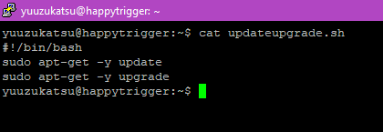 

### sed

Digunakan untuk mereplace suatu text dalam file

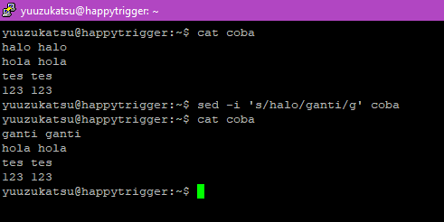 

### grep

Digunakan untuk mencari suatu text dalam file

 

### sort

Digunakan untuk mengurutkan text

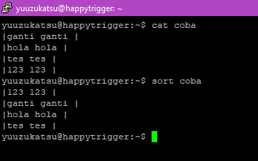 

### echo

Digunakan untuk menampilkan text pada terminal

 

### wc

Untuk menghitung ada berapa baris, kalimat, dan kata dalam file

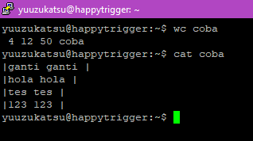 

### Bash Terminal Operator

Dalam penggunaan, ada operator yang dapat digunakan untuk menggabung
beberapa command menjadi satu. Beberapa operatornya antara lain adalah

-   `;` (sequence) untuk menjalankan beberapa command berurutan dan
    bergantian\
     

-   `&` (Parallel) untuk menjalankan beberapa command sekaligus\
     

-   `&&` (And) hanya akan menjalankan command kedua jika command pertama
    berhasil\
    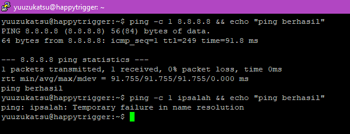 

-   `||` (Or) hanya akan menjalankan command kedua jika command pertama
    gagal\
    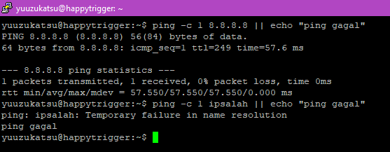 

-   `|` (Pipe) akan mengirimkan ouput command pertama ke command kedua\
     

-   `|&` (Pipe error) akan mengirimkan output error dari command pertama
    ke command kedua\
     

-   `<` (Redirecting input) untuk memasukkan input dari file ke command\
    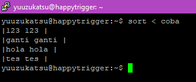 

-   `<<` (Redirecting input -- here documents) digunakan unuk memasukkan
    beberapa line input dari terminal ke suatu command\
     

-   `<<<` (Redirecting input -- here string) digunakan untuk memasukkan
    satu baris string input ke suatu command\
    

-   `>` (Redirect Output Truncate) untuk memasukkan output dari suatu
    command ke file. Jika file sudah ada, maka isinya akan dihapus lalu
    output command akan dimasukkan\
    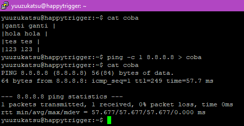 

-   `>>` (Redirect Output Append) untuk memasukkan output dari suatu
    command ke file. Jika file sudah ada, maka isinya tidak akan dihapus
    lalu output command akan dimasukkan ke line terakhir file\
     

## Aplikasi untuk monitoring

### htop

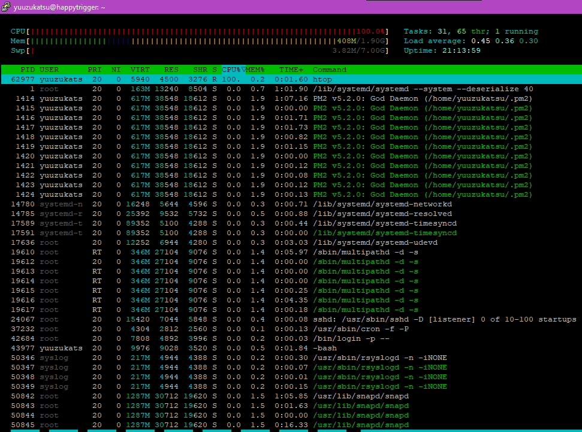 

### nmon 

 \
 

### ps 

Digunakan untuk melihat proses yang sedang berjalan

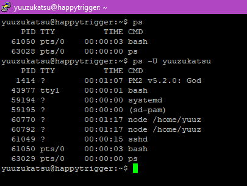 

### lsof

lsof (list of open files) digunakan untuk melihat file yang saat ini
digunakan proses

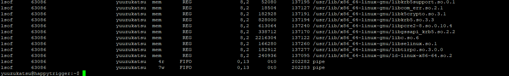 


## Membuat script bash untuk update dan upgrade

### Step 1

Buat file kosong baru dan isikan berikut
```
#!/bin/bash

sudo apt-get -y update

sudo apt-get -y upgrade
```
 

### Step 2

Tambahkan permission execute di file dengan command `chmod`

```chmod +x <file-name>```

 

### Step 3

Jalankan script dengan command berikut

```./<filename>```

atau

```bash <filename>```

 

## Membuat script bash untuk mencari file sysctl.conf

### Step 1

Buat file kosong dan isikan berikut
```
#!/bin/bash

sudo find / -name sysctl.conf -type f
```
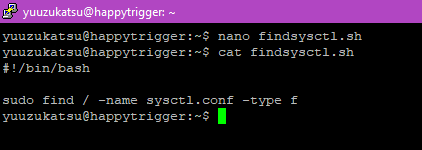 

### Step 2

Tambahkan permission execute di file dengan command `chmod`

```chmod +x <file-name>```

 

### Step 3

Jalankan script dengan command berikut

```./<filename>```

atau

```bash <filename>```

 
## Membuat script bash untuk membuka firewall port 22, 80, dan 443

### Step 1

Buat file kosong dan isikan berikut
```
#!/bin/bash

sudo ufw allow ssh

sudo ufw allow http

sudo ufw allow https

yes | sudo ufw enable
```
 

### Step 2

Tambahkan permission execute di file dengan command `chmod`

```chmod +x <file-name>```

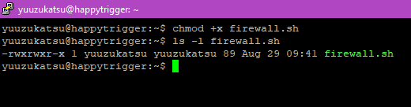 

### Step 3

Jalankan script dengan command berikut

```./<filename>```

atau

```bash <filename>```

 
