## Apa itu Cloud Computing

Cloud Computing merupakan sumber daya komputer yang dijalankan secara
remote di cloud atau di server yang terhubung ke internet

## Generate RSA Key untuk SSH

Ada banyak cara untuk generate RSA Key, kita bisa menggunakan PuTTYgen
dari PuTTY atau menggunakan command `ssh-keygen`. Contoh berikut akan
menggunakan command `ssh-keygen` dari openssh windows dan PuTTYgen

### 1.ssh-keygen

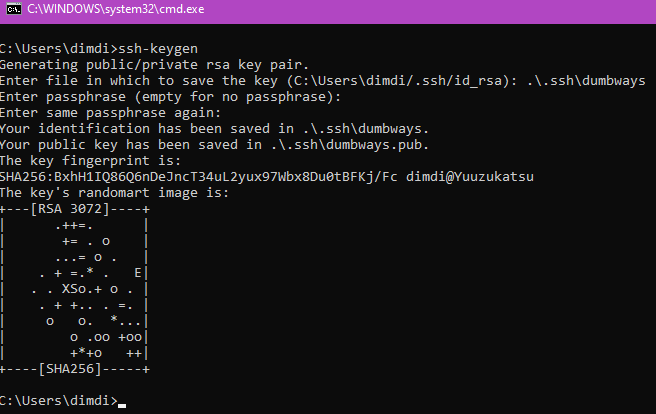 

### 2.PuTTYGen

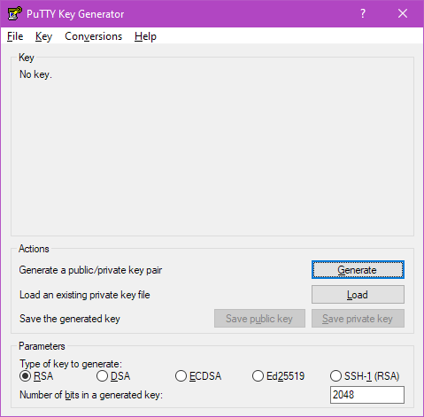 

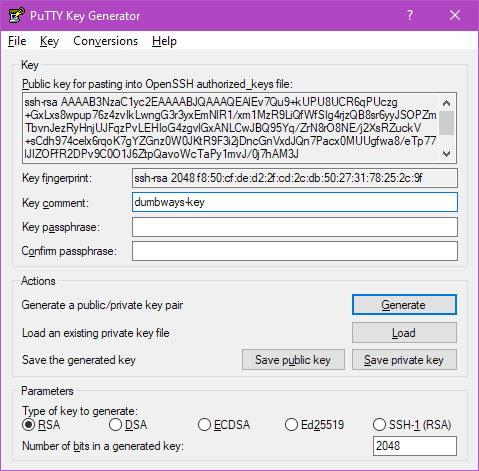 
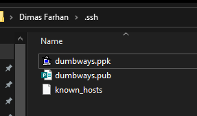 

## Membuat instance di ID Cloud Host + Setup SSH Key

### Step 1

Buka dan login ke console id cloudhost
`https://console.idcloudhost.com/`

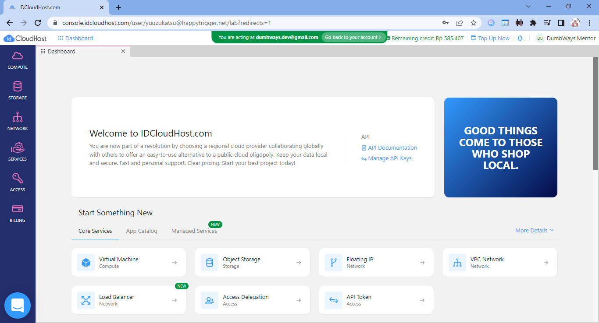 

### Step 2

Pilih menu COMPUTE lalu New atau Virtual Machine

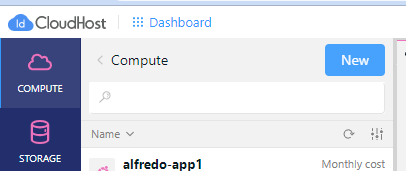 

### Step 3

Buat instance dengan spesifikasi berikut
```
Type : Virtual Machine
OS : Ubuntu
Location : Indonesia
Size : 1 CPU, 1GB Ram, 20GB Disk
Centang Public IP
VPC Network : My Network
Username : <sesuaikan>
Password : <sesuaikan>
Resource Name : <nama>-app-server
```
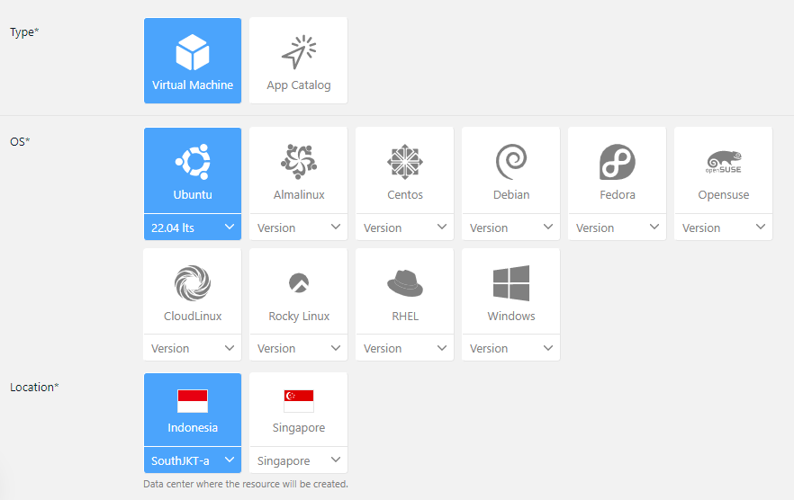 

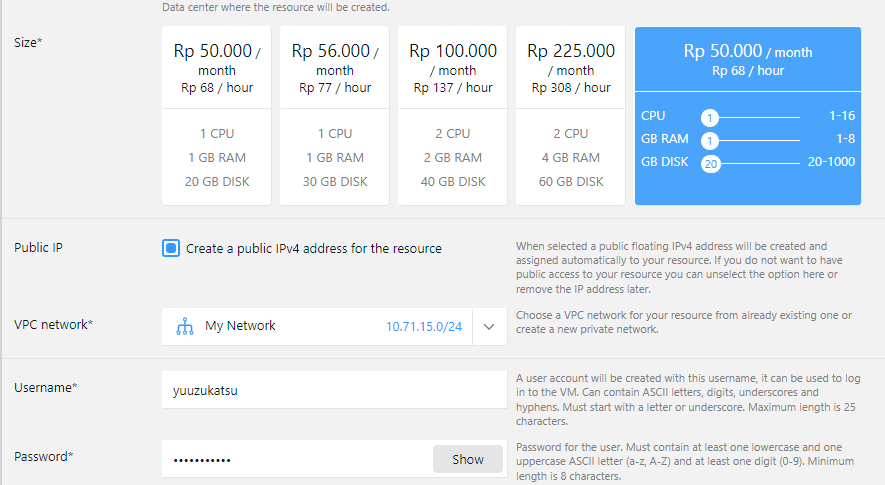 

### Step 4

Tunggu hingga proses building selesai

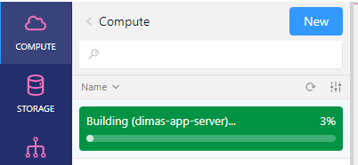 

### Step 5

Setelah proses building selesai, buka instance yang dibuat lalu coba
akses ip publicnya melalui ssh

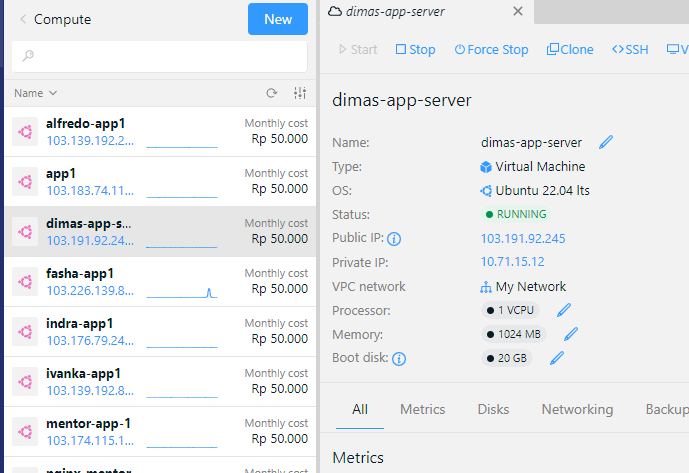

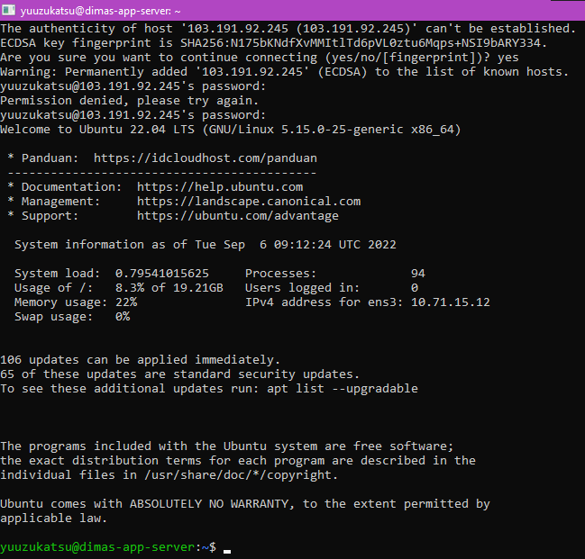 

### Step 6

Selanjutnya kita akan mengimport key public yang sudah dibuat sebelumnya dengan command `ssh-keygen` ke server app dengan command `scp`
```
scp <public-key-name> yuuzukatsu@103.191.92.245:~/.ssh
```
 

### Step 7

Masukkan isi file dumbways.pub ke file authorized_keys

```
cat <public-key-name> >> authorized_keys
```

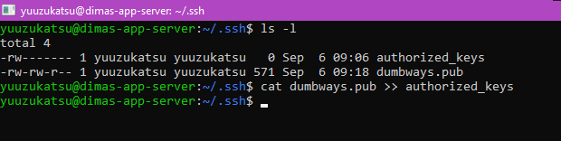 

### Step 8

Selanjutnya kita akan coba login ke server dengan private key. Gunakan
command berikut
```
ssh -i <private-key-file> <user>@<ip-address>
```
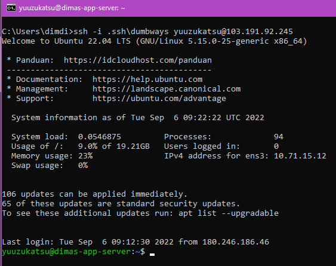 

## Instalasi aplikasi Dumbflix + pm2

### Step 1

Lakukan instalasi nvm dan npm versi 10
```
curl -o- https://raw.githubusercontent.com/nvm-sh/nvm/v0.39.1/install.sh | bash
exec bash
nvm install 10
```
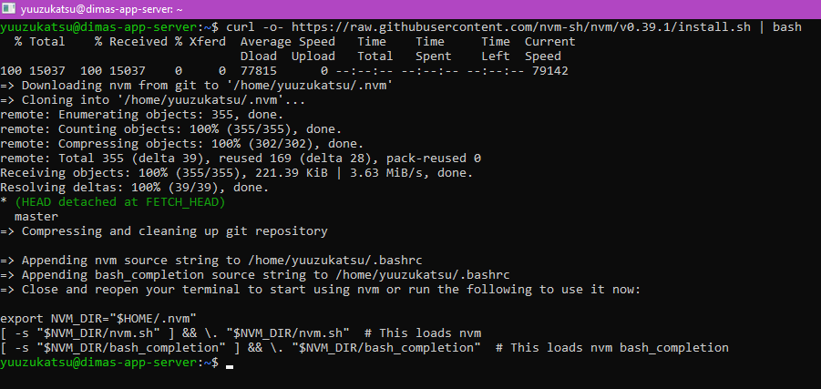 

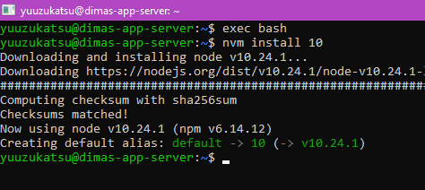 

### Step 2

Lakukan instalasi pm2
```
npm install -g pm2
```
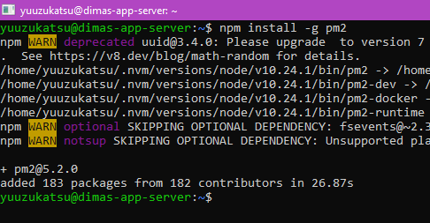 

### Step 3
```
clone repo https://github.com/dumbwaysdev/dumbflix-frontend
git clone https://github.com/dumbwaysdev/dumbflix-frontend.git
```
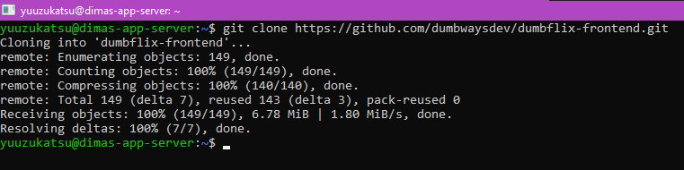 

### Step 4

Masuk ke direktori lalu jalankan `npm install`
```
cd dumbflix-frontend/
npm install
```
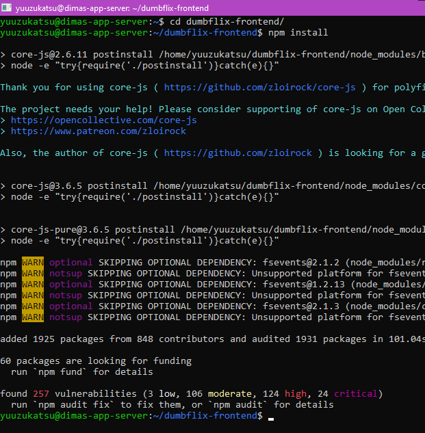 

### Step 5

Jalankan command berikut untuk create file script pm2
```
pm2 init simple
```
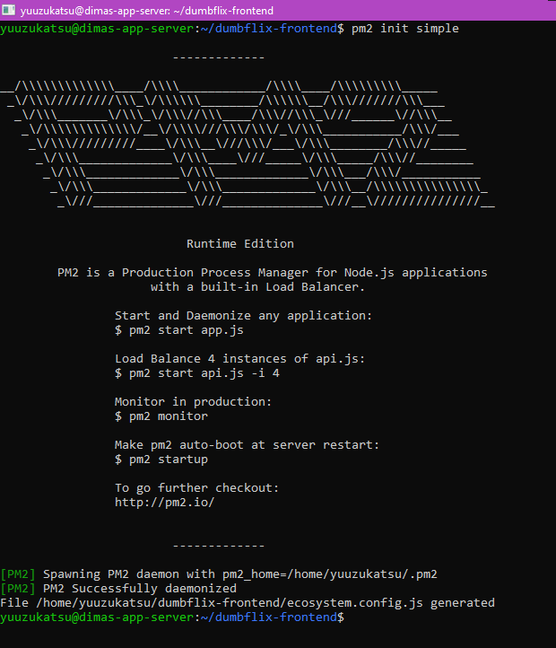 

### Step 6

Edit file `ecosystem` lalu rubah bagian script menjadi `npm start`

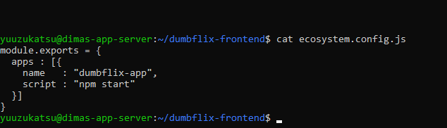 

### Step 7

Jalankan script dengan pm2
```
pm2 start ecosystem.config.js
```
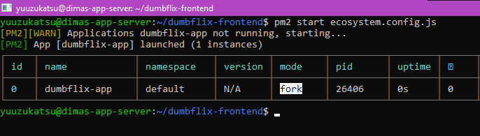 

### Step 8
```
Coba buka di web browser melalui <ip-server>:3000
```
 

## Setup DNS Cloudflare + Reverse Proxy Nginx

Pada setup ini, saya sudah membuat instance khusus untuk Reverse Proxy Nginx

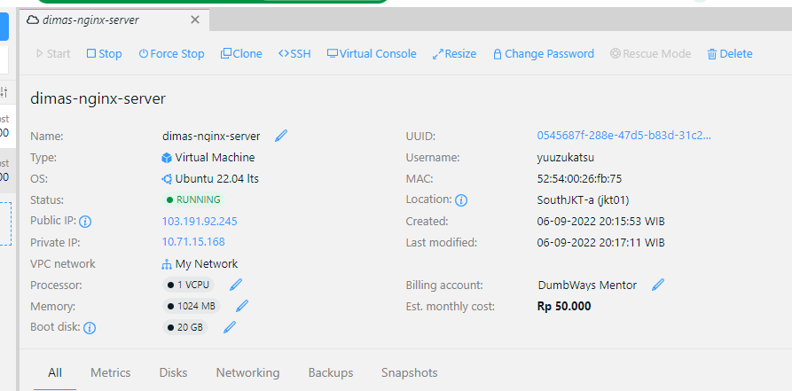

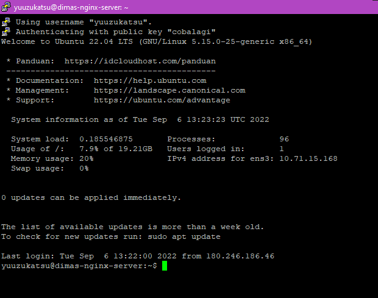 

### Step 1

Pertama, kita akan membuat dns record dulu di cloudflare

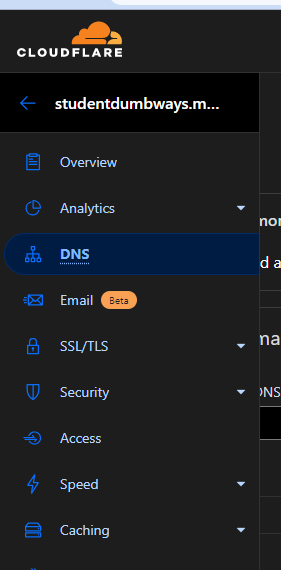 

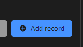 

 

Isikan Ipv4 address dengan ip server nginx

### Step 2

Lakukan instalasi nginx di server
```
sudo apt-get update
sudo apt-get install nginx
```
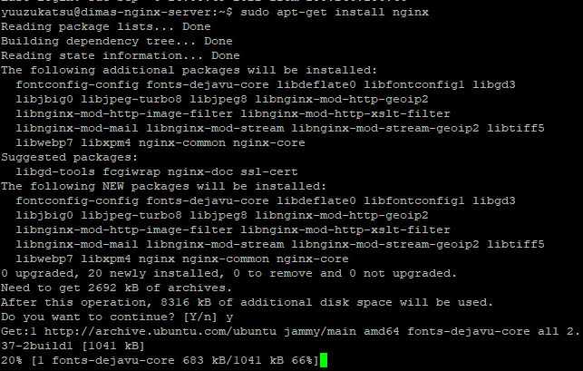 

### Step 3

Buat file konfigurasi baru di folder `/etc/nginx/sites-enabled`
```
sudo nano /etc/nginx/sites-enabled/rp-dumbflix.conf
```
Lalu isikan berikut
```
server{
    server_name <url-domain>;
    location / {
        proxy_pass http://<ip-server>:<port>;
    }
}
```
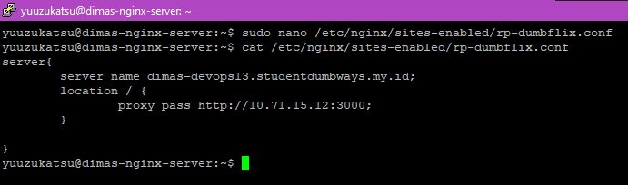{width="6.268055555555556in"
height="1.85in"}

### Step 4

Cek konfigurasi sudah sesuai dengan command berikut

sudo nginx -t

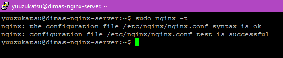 

### Step 5

Lakukan reload / restart ke service nginx
```
sudo systemctl reload nginx
```
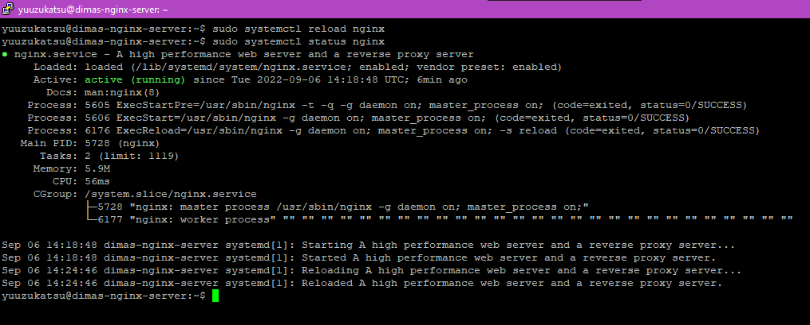 

### Step 6

Cek url melalui browser

 
