## Intalasi Database MySQL

Dalam instalasi Database, sudah dicreate instance server tersendiri
untuk database.

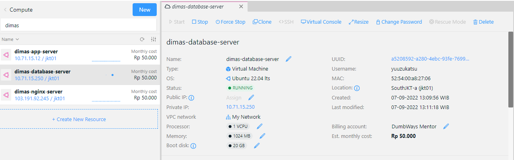 

 

### Step 1

Lakukan instalasi mysql dengan command berikut
```
sudo apt-get update && sudo apt-get install -y mysql-server
```
### Step 2

Kita akan melakukan setup mysql dulu supaya database bisa diakses dengan
user root
```
sudo mysql
```
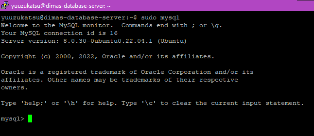 

### Step 3

Jalankan urutan command berikut, sesuaikan untuk password yang ingin
digunakan untuk user root database
```
ALTER USER 'root'@'localhost' IDENTIFIED WITH mysql_native_password by '<password>';
exit
```
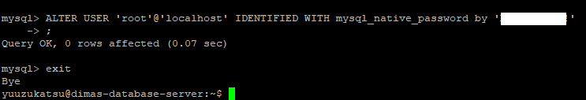 

### Step 4

Jalankan command berikut
```
mysql_secure_installation
```
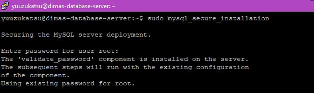 

### Step 5

Selanjutnya, kita akan membuat user khusus untuk database dumbflix.
Jalankan urutan command berikut
```
mysql -u root -p
CREATE USER '<username>'@'%' IDENTIFIED BY '<password>';
CREATE DATABASE <database-name>;
GRANT ALL ON <database-name>.* TO '<username>'@'%';
exit
```
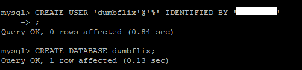 
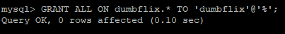 

### Step 6

Selanjut kita tes dulu untuk user dan database bisa diakses
```
mysql -u dumbflix -p
use dumbflix
show tables;
```
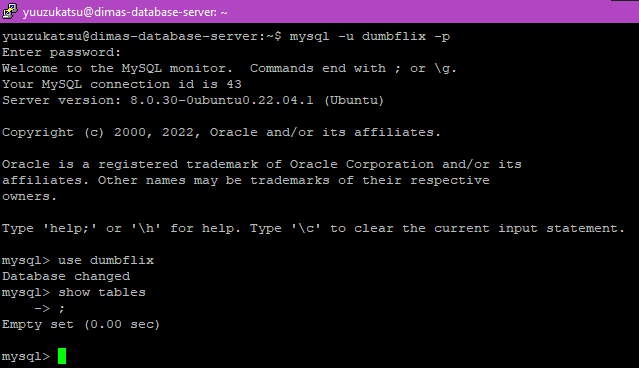 

### Step 7

Buka file `/etc/mysql/mysql.conf.d/mysqld.cnf`
```
sudo nano /etc/mysql/mysql.conf.d/mysqld.cnf
```
lalu rubah line `bind-address` dan `mysqlx-bind-address` menjadi seperti berikut
```
bind-address = 0.0.0.0
mysqlx-bind-address = 0.0.0.0
```
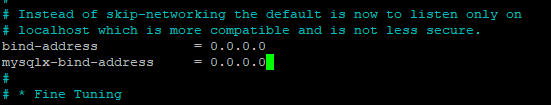{width="5.740384951881015in"
height="1.0939031058617672in"}

### Step 8

Lakukan restart service `mysql`
```
sudo systemctl restart mysql.service
```
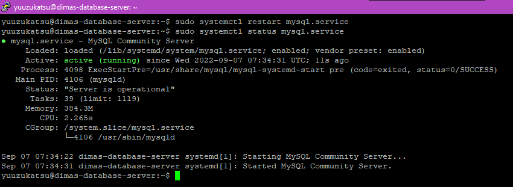 

## Setup aplikasi backend dan integrasi dengan database

### Step 1

Pertama kita akan clone dulu aplikasi backend dumbflix
```
git clone https://github.com/dumbwaysdev/dumbflix-backend.git
```
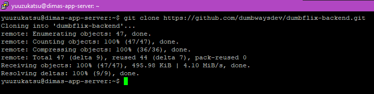 

### Step 2

Kita akan mengikuti environment yang diminta dari file `readme.md`

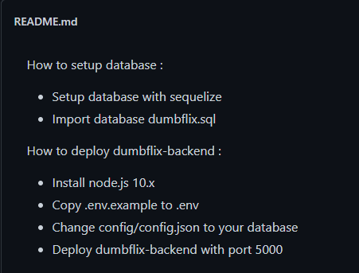 

Menggunakan nodejs 10

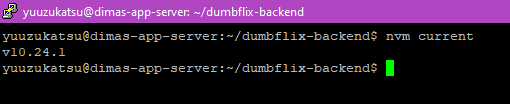

Isi file `config.json` disesuaikan

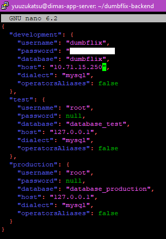 

Untuk import database, gunakan command berikut
```
mysql -h 10.71.15.250 -u dumbflix -p -D dumbflix < dumbflix.sql
```
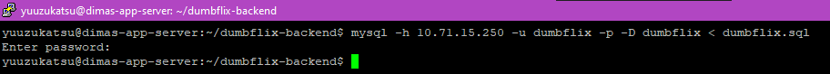 

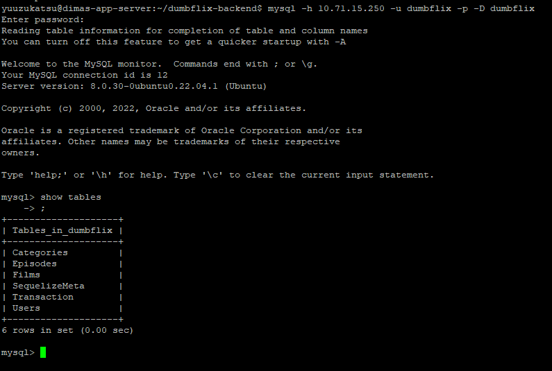 

### Step 3

Sesuaikan konfigurasi di Frontend agar bisa terkoneksi ke Backend

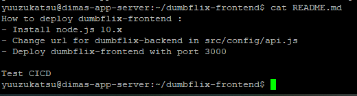 

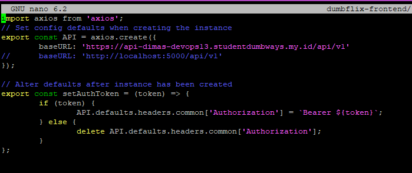 

### Step 4

Jalankan aplikasi dengan `PM2`

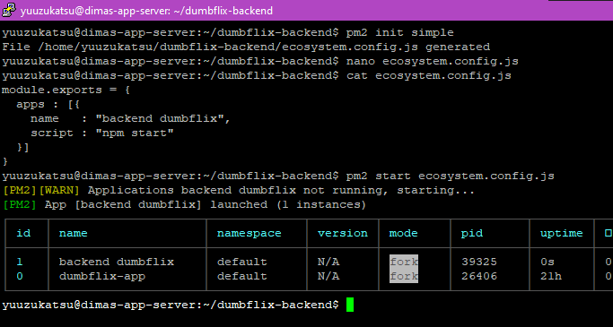 

### Step 5

Tes fitur Register dan Login website

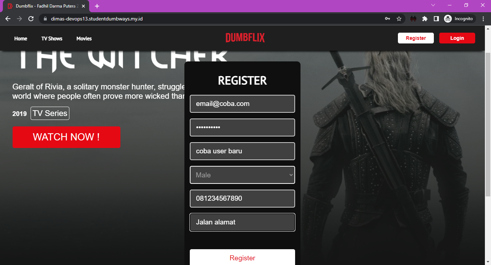 

 

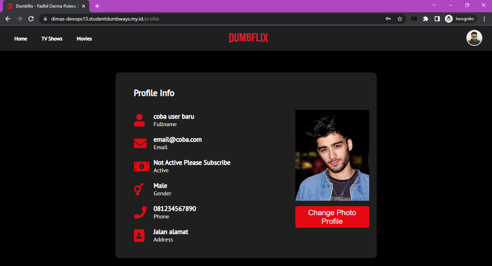 

## Setup SSL dengan CertBot

### Step 1

Lakukan instalasi berikut
```
sudo apt-get install snapd
sudo snap install core; sudo snap refresh core
sudo apt-get install certbot python3-certbot-nginx
```
### Step 2

Jalankan command ini untuk instalasi certificate secara otomatis.
```
sudo certbot --nginx
```
Akan muncul prompt setelah command dijalankan. Isikan sesuai kebutuhan

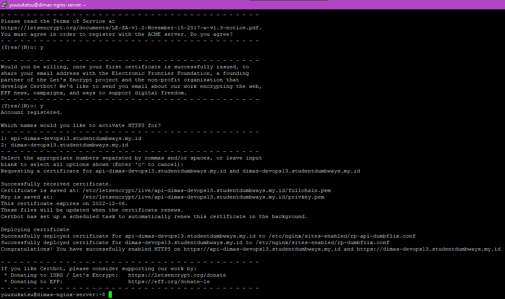 

### Step 3

Setelah proses selesai, tes dengan membuka browser

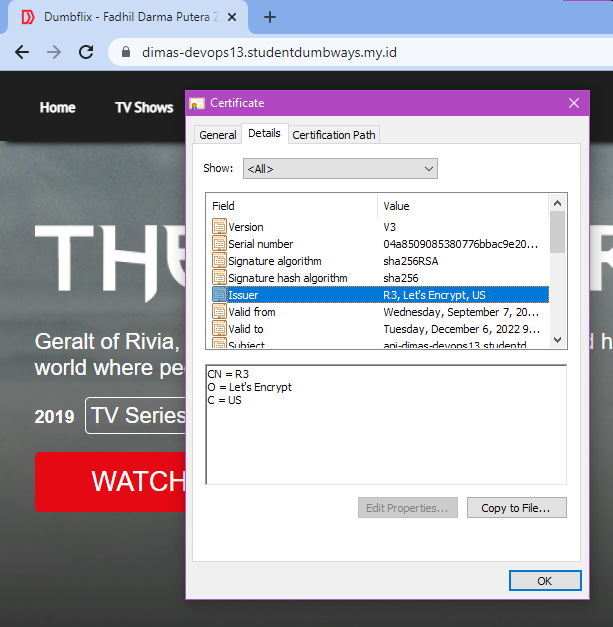 
