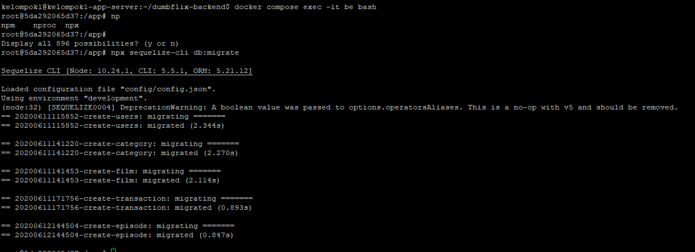

## Deploy Backend Dumbflix dan Database dalam 1 Docker Compose

### Step 1

Clone Repo Backend Dumbflix
```
git clone https://github.com/dumbwaysdev/dumbflix-backend.git
```
 

### Step 2

Ikuti instruksi didalam `README.md`

 

Edit file `~/dumbflix-backend/config/config.json` Sesuaikan dengan
database yang akan dibuat

 

### Step 3

Buat file `Dockerfile`, dan isikan berikut
```
FROM node:10
WORKDIR /app
COPY . .
RUN npm install
RUN npm install sequelize-cli
RUN wget https://raw.githubusercontent.com/vishnubob/wait-for-it/master/wait-for-it.sh
RUN chmod +x wait-for-it.sh
RUN echo '#!/bin/bash' > start-server.sh
RUN echo 'npx sequelize-cli db:migrate' >> start-server.sh
RUN echo 'npm start' >> start-server.sh
RUN chmod +x start-server.sh
EXPOSE 5000
CMD ["npm", "start"]
```
 

### Step 4

Buat file `docker-compose.yml` dan isikan berikut
```
version: '3.8'
services:
  backend:
    build: .
    depends_on:
      - db
    ports:
      - '5000:5000'
    expose:
      - '5000'
    command: ./wait-for-it.sh db:3306 -s -- ./start-server.sh
  db:
    image: mysql:8
    restart: always
    environment:
      MYSQL_DATABASE: 'dumbflix'
      MYSQL_USER: 'dumbflix'
      MYSQL_PASSWORD: 'dumbflix'
      MYSQL_ROOT_PASSWORD: 'P4ssword!'
    ports:
      - '3306:3306'
    expose:
      - '3306'
    volumes:
      - database:/var/lib/mysql

volumes:
```

### Step 5

Jalankan command docker compose untuk mulai build
```
docker compose up -d
```
 

### Step 6

Masuk ke container backend dengan command berikut
```
docker compose exec -it backend bash
```
Lalu jalankan command berikut untuk import database ke server mysql
```
npx sequelize-cli db:migrate
```
 

## Upload Docker Images ke hub.docker.com

### Step 1

Login ke docker dengan command berikut
```
docker login
```


### Step 2

Jalankan command berikut untuk memberi tag ke images yang akan di upload
```
docker tag <nama images>:latest <username>/dumbflix-backend:v1
```
 

### Step 3

Lakukan push dengan command berikut
```
docker image push yuuzukatsu/dumbflix-backend:v1
```
 
