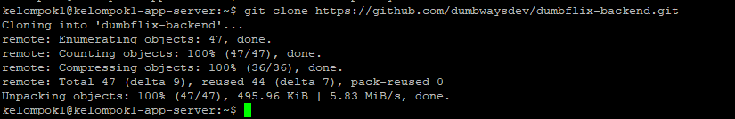
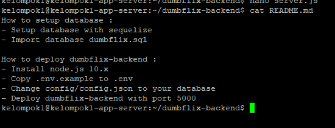
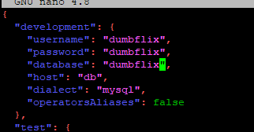
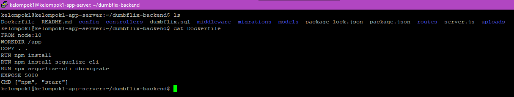
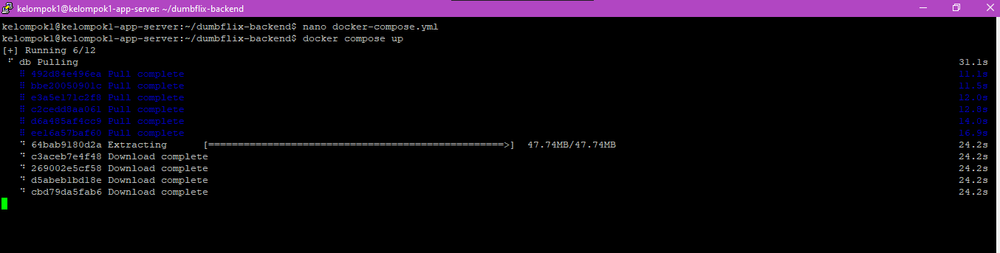
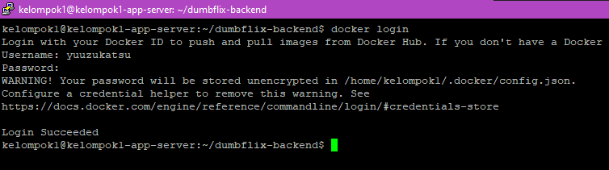
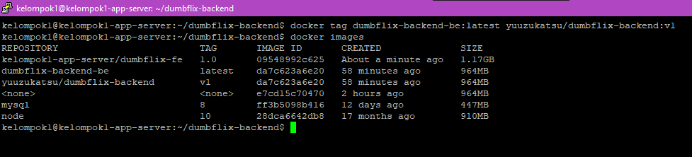
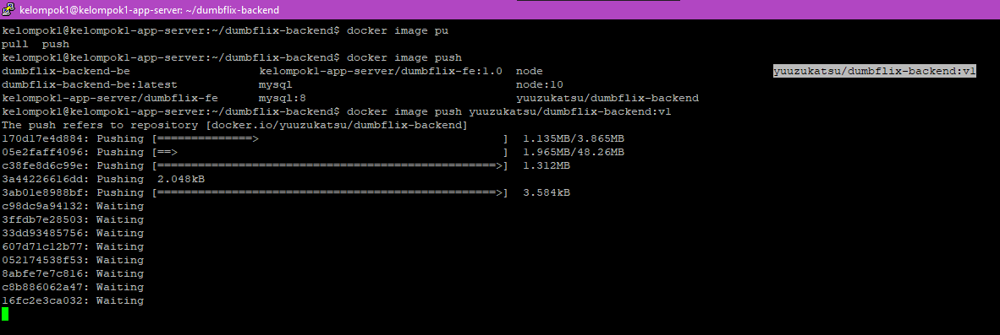

# Day 3

# Docker

## Buat Script Untuk Instalasi Docker Secara Otomatis

```
#!/bin/bash

sudo apt-get update

sudo apt-get install \ ca-certificates \ curl \ gnupg \ lsb-release \ apt-transport-https \ software-properties-common

sudo mkdir -p /etc/apt/keyrings

curl -fsSL https://download.docker.com/linux/ubuntu/gpg | sudo gpg --dearmor -o /etc/apt/keyrings/docker.gpg

echo \
  "deb [arch=$(dpkg --print-architecture) signed-by=/etc/apt/keyrings/docker.gpg] https://download.docker.com/linux/ubuntu \
  $(lsb_release -cs) stable" | sudo tee /etc/apt/sources.list.d/docker.list > /dev/null

sudo apt-get update

sudo apt-get install docker-ce docker-ce-cli containerd.io docker-compose-plugin

docker -v
```


## Frontend App in Docker

### Buat file bernama Dockerfile dan masukkan konfigurasi di bawah ini

```
FROM node:[version]
WORKDIR [directory]
COPY . .
RUN npm install
EXPOSE 3000
CMD [ "npm", "start" ]
```


### Jalankan perintah build untuk melakukan build Dockerfile yang telah dibuat agar dapat menjadi Docker Images.


### Push images yang ada di local ke dalam server di Dockerhub/docker registry.


### Buat Docker Container

```
docker container create --name (name) -p (custom-port):(application-port) (images):(tag)
```


### Jalankan Docker Container

docker container start (name)


### Buat file bernama docker-compose.yaml

```
version: '3.8'
services:
 frontend:
   build: .
   container_name: dumbways-frontend
   image: malikalrk/dumbways-fe:1.0
   stdin_open: true
   ports:
    - 3000:3000
```


### Jalankan docker compose yang telah dibuat


### Integrasikan Frontend dan Backend

Edit file API


### Coba Akses Aplikasi pada Web


## Deploy Backend Dumbflix dan Database dalam 1 Docker Compose

### Step 1

Clone Repo Backend Dumbflix
```
git clone https://github.com/dumbwaysdev/dumbflix-backend.git
```
 

### Step 2

Ikuti instruksi didalam `README.md`

 

Edit file `~/dumbflix-backend/config/config.json` Sesuaikan dengan
database yang akan dibuat

 

### Step 3

Buat file `Dockerfile`, dan isikan berikut
```
FROM node:10
WORKDIR /app
COPY . .
RUN npm install
RUN npm install sequelize-cli
RUN wget https://raw.githubusercontent.com/vishnubob/wait-for-it/master/wait-for-it.sh
RUN chmod +x wait-for-it.sh
RUN echo '#!/bin/bash' > start-server.sh
RUN echo 'npx sequelize-cli db:migrate' >> start-server.sh
RUN echo 'npm start' >> start-server.sh
RUN chmod +x start-server.sh
EXPOSE 5000
CMD ["npm", "start"]
```
 

### Step 4

Buat file `docker-compose.yml` dan isikan berikut
```
version: '3.8'
services:
  backend:
    build: .
    depends_on:
      - db
    ports:
      - '5000:5000'
    expose:
      - '5000'
    command: ./wait-for-it.sh db:3306 -s -t 0 -- ./start-server.sh
  db:
    image: mysql:8
    restart: always
    environment:
      MYSQL_DATABASE: 'dumbflix'
      MYSQL_USER: 'dumbflix'
      MYSQL_PASSWORD: 'dumbflix'
      MYSQL_ROOT_PASSWORD: 'P4ssword!'
    ports:
      - '3306:3306'
    expose:
      - '3306'
    volumes:
      - database:/var/lib/mysql

volumes:
```

### Step 5

Jalankan command docker compose untuk mulai build
```
docker compose up -d
```
 

### Step 6

Cek aplikasi sudah berjalan


## Upload Docker Images ke hub.docker.com

### Step 1

Login ke docker dengan command berikut
```
docker login
```


### Step 2

Jalankan command berikut untuk memberi tag ke images yang akan di upload
```
docker tag <nama images>:latest <username>/dumbflix-backend:v1
```
 

### Step 3

Lakukan push dengan command berikut
```
docker image push yuuzukatsu/dumbflix-backend:v1
```
 


# reverse proxy and use cerbot

menggunakan dns cloudflare
1.masuk ke cloudflare lalu ke bagian dns, masukkan nama domain dan ip dituju

frontend


backend


reverse proxy for docker

1.update server terlebih dahulu `sudo apt update` lalu install nginx `sudo apt install nginx`


2.buat direktori pada /etc/nginx/ 


3.buat file di direktori tersebut sudo nano `frontend.conf` dan masukkan konfigurasi reverse proxy sesuai dicloudflare tadi untuk frontend kita gunakan port 3000


lakukan yang sama untuk backend untuk backend kita gunakan port 5000


4.jika sudah masuk file nginx.conf di /etc/nginx/nginx.conf


lakukan include /etc/nginx/nama_dir_yang_dibuat_tadi/*;

5.lakukan pengecekkan apakah syntax nginx tidak terjadi masalah `sudo nano nginx -t`, jika benar restart nginx `sudo systemctl restart nginx`


menggunakan certbot untuk ip yang digunakan

1.install snapd dan refresh ke versi terbaru jika sudah terinstall `sudo snap install snap-core; sudo snap refresh core`


2.install certbot `sudo snap install --classic certbot


3.memastikan perintah certbot berjalan


4.lalu jalankan `sudo cerbot --nginx, pilih domain yang ingin menggunakan ssl certificate


nanti akan di tanya email dan lain lain sesuai preferensi kalian

5.jika sudah kalian bisa cek di file reverse proxy kalian yang sudah dikonfirmasi menggunakan ssl 


