# Day 1 Instalasi Ubuntu Server

## Step 1

Download file iso ubuntu server dari
<https://ubuntu.com/download/server>

{width="6.268055555555556in"
height="4.03125in"}

## Step 2

Download dan install vmware

## Step 3

Buka lalu tambahkan virtual machine baru di vmware

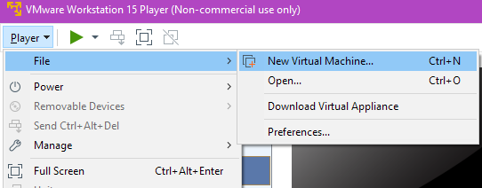{width="5.646621828521435in"
height="2.2086417322834646in"}

Step 4

Pilih file .iso yang didownload dari step 1 sebelumnya

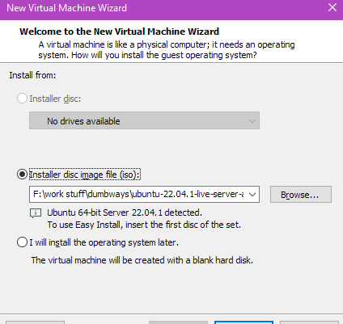{width="4.417283464566929in"
height="4.177666229221347in"}

Step 5

Isikan nama virtual machine dan lokasi virtual machine

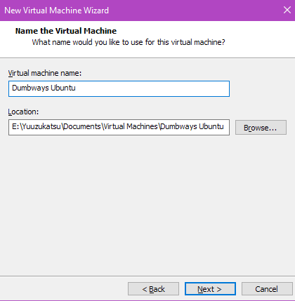{width="4.3756102362204725in"
height="4.469373359580053in"}

Step 6

Isikan besar kapasitas storage untuk virtual machine

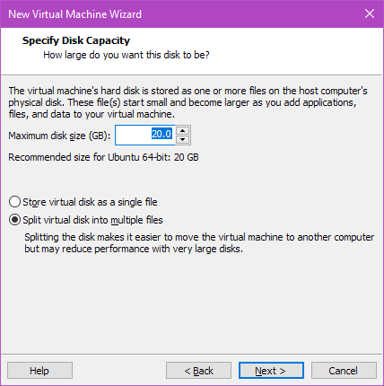{width="4.458333333333333in"
height="4.479166666666667in"}

Step 7

Rubah alokasi total ram, cpu, atau yang lainnya jika diperlukan.

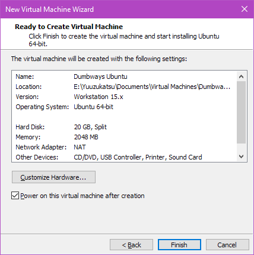{width="4.458333333333333in"
height="4.479166666666667in"}

Step 8

Rubah setting network adapter dari Nat menjadi Bridge\
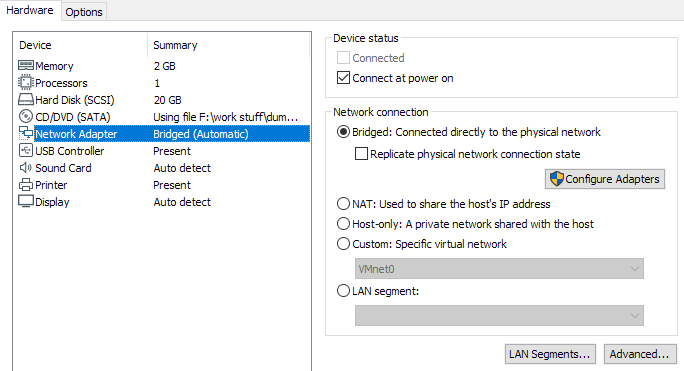{width="6.268055555555556in"
height="3.3993055555555554in"}

Step 9

Jalankan atau klik play jika virtual machine belum dimulai

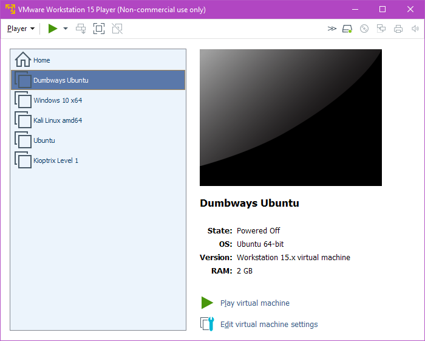{width="6.268055555555556in"
height="5.023611111111111in"}

Step 10

Pada pilihan berikut, pilih try or install ubuntu server

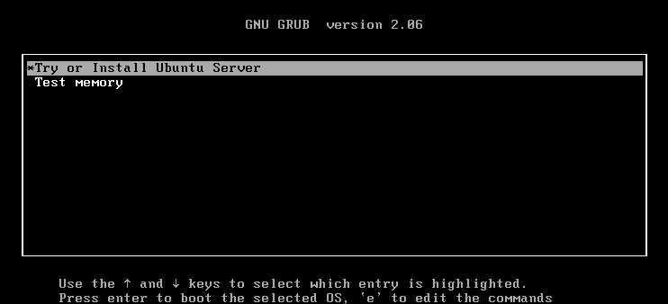{width="6.268055555555556in"
height="2.854861111111111in"}

Step 11\
Pilih bahasa dan layout keyboard yang ingin digunakan. Pilih done jika
selesai

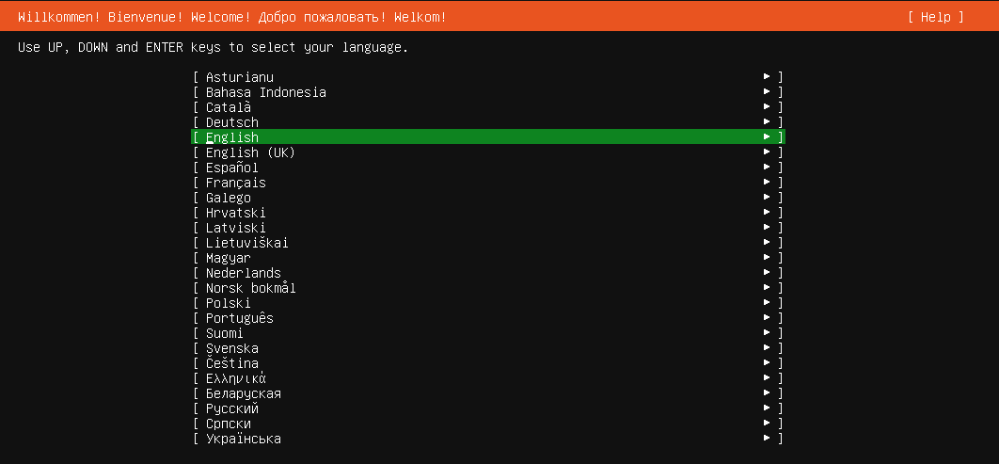{width="6.268055555555556in"
height="2.9097222222222223in"}\
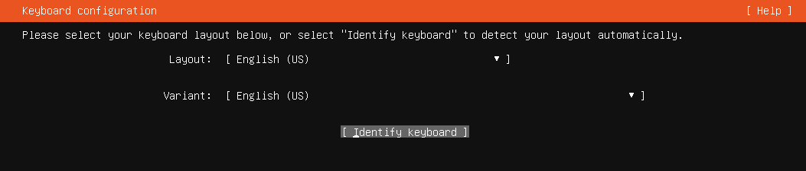{width="6.268055555555556in"
height="1.3388888888888888in"}

Step 12\
Pilih Ubuntu Server(minimized)

{width="6.268055555555556in"
height="1.4986111111111111in"}

Step 13\
Ubah konfigurasi ip dari dhcp ke static(manual). Lalu isikan ip,
gateway, dan dns sesuai jaringan yang digunakan

{width="6.268055555555556in"
height="1.4159722222222222in"}\
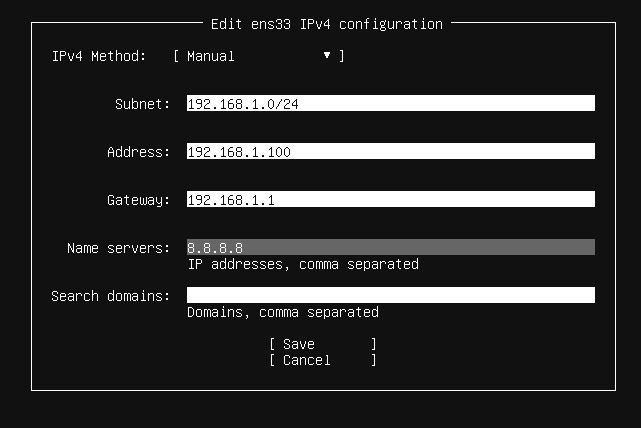{width="6.268055555555556in"
height="4.184722222222222in"}

Step 14\
Isikan proxy address jika menggunakan

{width="6.268055555555556in"
height="1.2680555555555555in"}

Step 15\
Isikan mirror address/reposity yang ingin digunakan

{width="6.268055555555556in"
height="0.8951388888888889in"}

Step 16\
Pilih Custom storage layout untuk merubah partisi. Gunakan Use an entire
disk jika tidak yakin (skip ke step 19)

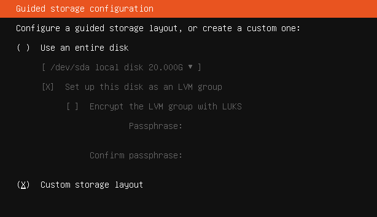{width="6.268055555555556in"
height="3.623611111111111in"}

Step 17\
Tambahkan partisi baru dengan memilih Free space \> Add GPT Partition.
Lalu isikan sesuai kebutuh

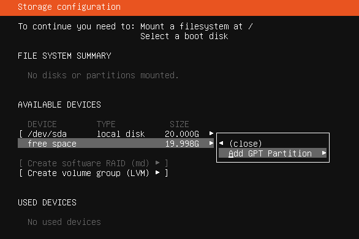{width="6.105018591426072in"
height="4.073485345581802in"}\
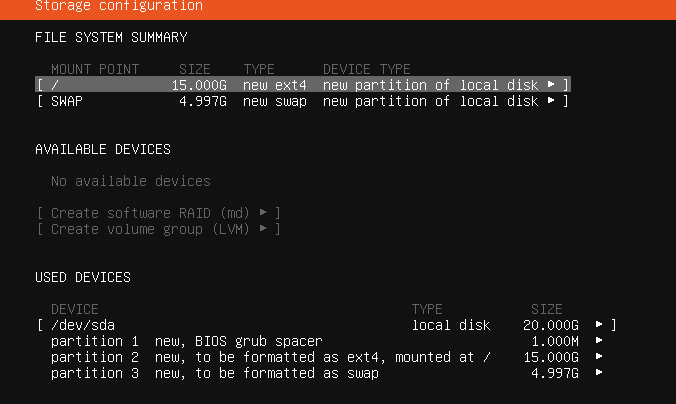{width="6.268055555555556in"
height="3.745833333333333in"}

Step 18\
Pilih continue saja pada bagian ini (pada part ini, disk virtual machine
yang digunakan akan di format)

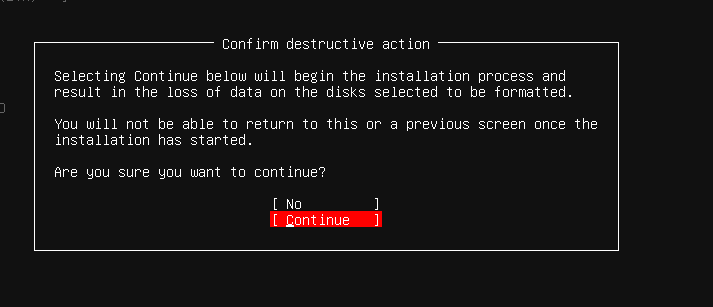{width="6.268055555555556in"
height="2.698611111111111in"}

Step 19\
Isikan nama, username, dan password yang ingin digunakan

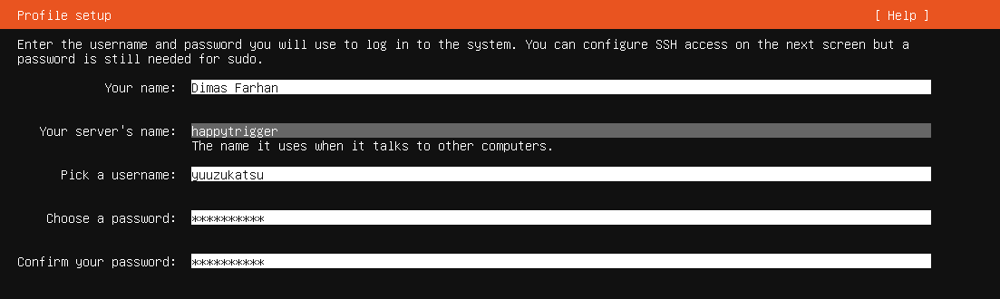{width="6.268055555555556in"
height="1.875in"}

Step 20\
Pilih install OpenSSH Server

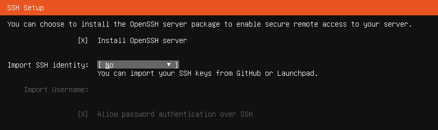{width="6.268055555555556in"
height="1.8597222222222223in"}

Step 21\
Pilih package yang ingin diinstall, lewati saja jika tidak ingin

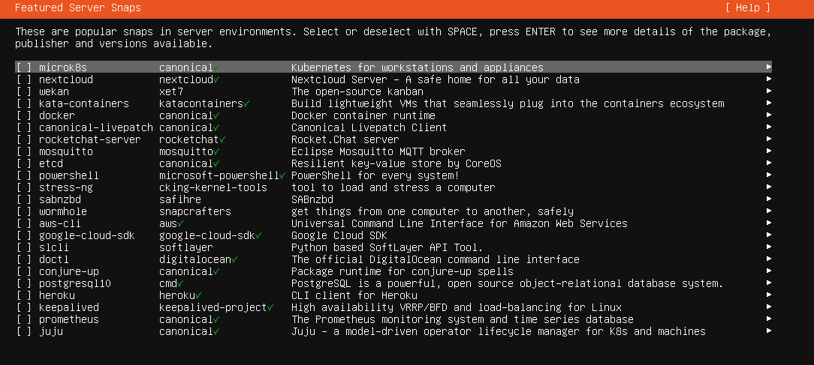{width="6.268055555555556in"
height="2.8159722222222223in"}

Step 22\
Tunggu proses instalasi selesai

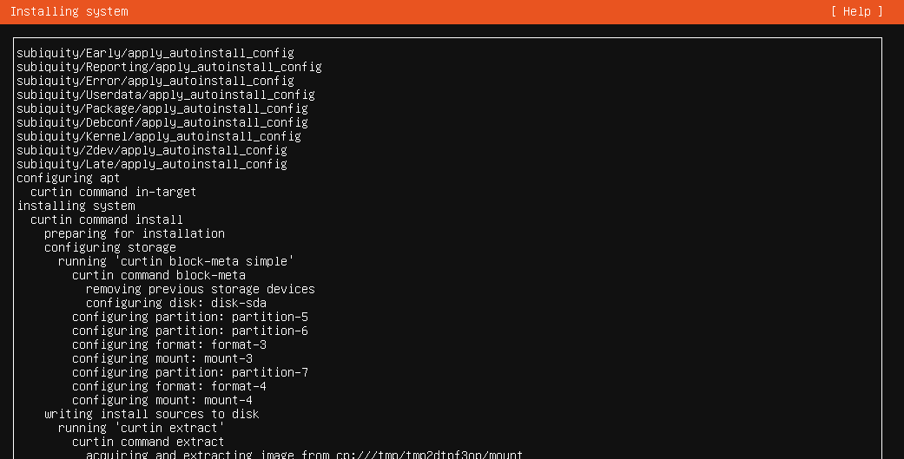{width="6.268055555555556in"
height="3.185416666666667in"}

Step 23
