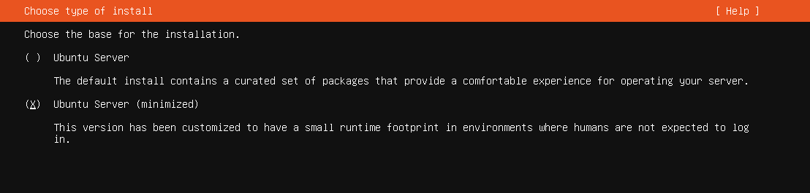
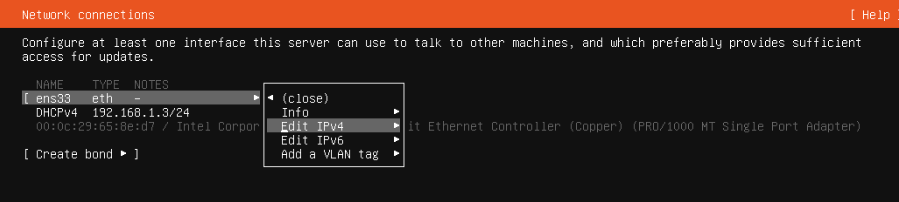
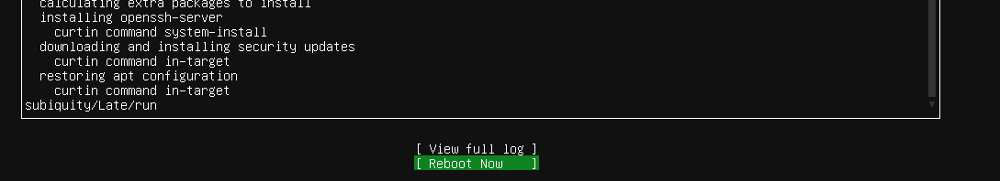
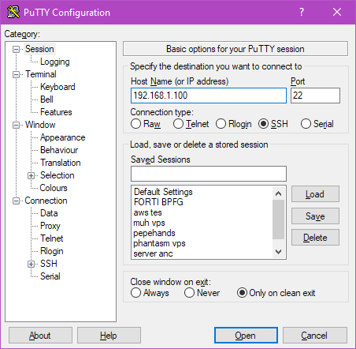
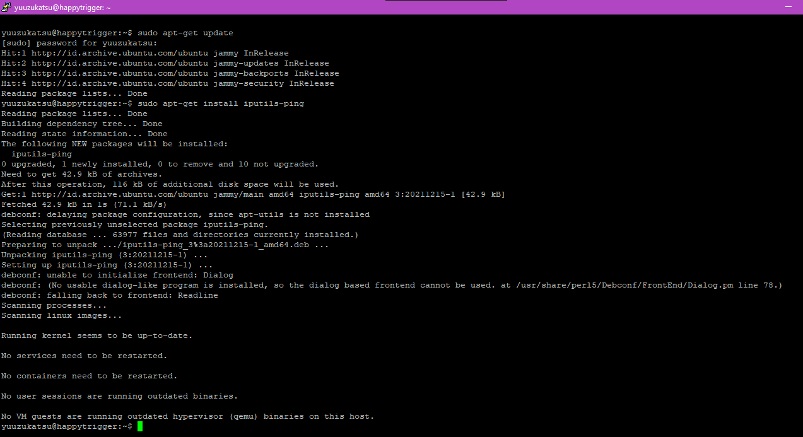
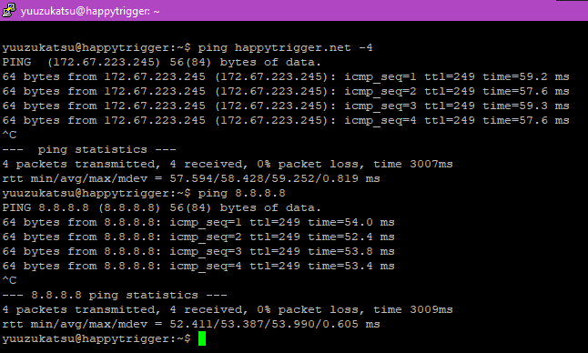
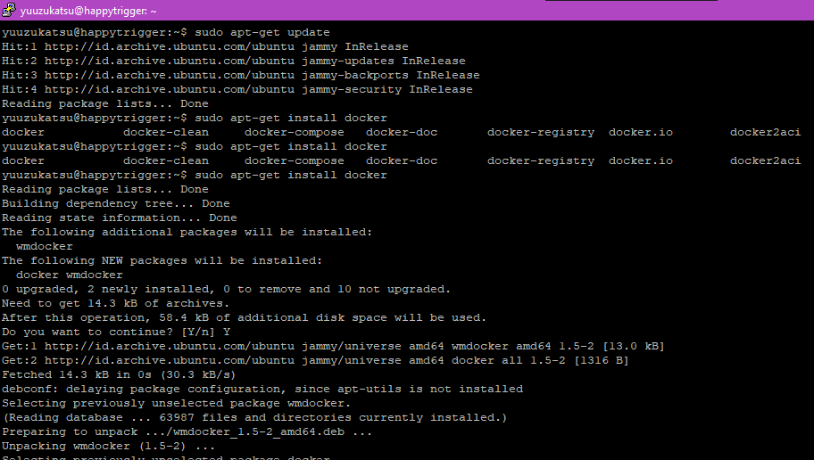

# Day 1

# Definisi DevOps

Menurut saya, DevOps adalah kelompok atau bagian dari suatu team yang
bertugas untuk maintaining, monitoring, dan developing infrastruktur
untuk suatu aplikasi yang dikembangkan oleh developer code

#  Instalasi Ubuntu Server

## Step 1

Download file iso ubuntu server dari
<https://ubuntu.com/download/server>

{width="6.268055555555556in"
height="4.03125in"}

## Step 2

Download dan install vmware

## Step 3

Buka lalu tambahkan virtual machine baru di vmware

{width="5.646621828521435in"
height="2.2086417322834646in"}

## Step 4

Pilih file .iso yang didownload dari step 1 sebelumnya

{width="4.417283464566929in"
height="4.177666229221347in"}

## Step 5

Isikan nama virtual machine dan lokasi virtual machine

{width="4.3756102362204725in"
height="4.469373359580053in"}

## Step 6

Isikan besar kapasitas storage untuk virtual machine

{width="4.458333333333333in"
height="4.479166666666667in"}

## Step 7

Rubah alokasi total ram, cpu, atau yang lainnya jika diperlukan.

{width="4.458333333333333in"
height="4.479166666666667in"}

## Step 8

Rubah setting network adapter dari Nat menjadi Bridge\
{width="6.268055555555556in"
height="3.3993055555555554in"}

## Step 9

Jalankan atau klik play jika virtual machine belum dimulai

{width="6.268055555555556in"
height="5.023611111111111in"}

## Step 10

Pada pilihan berikut, pilih try or install ubuntu server

{width="6.268055555555556in"
height="2.854861111111111in"}

## Step 11

Pilih bahasa dan layout keyboard yang ingin digunakan. Pilih done jika
selesai

{width="6.268055555555556in"
height="2.9097222222222223in"}\
{width="6.268055555555556in"
height="1.3388888888888888in"}

## Step 12

Pilih Ubuntu Server(minimized)

{width="6.268055555555556in"
height="1.4986111111111111in"}

##  Step 13

Ubah konfigurasi ip dari dhcp ke static(manual). Lalu isikan ip,
gateway, dan dns sesuai jaringan yang digunakan

{width="6.268055555555556in"
height="1.4159722222222222in"}\
{width="6.268055555555556in"
height="4.184722222222222in"}

## Step 14

Isikan proxy address jika menggunakan

{width="6.268055555555556in"
height="1.2680555555555555in"}

## Step 15

Isikan mirror address/reposity yang ingin digunakan

{width="6.268055555555556in"
height="0.8951388888888889in"}

## Step 16

Pilih Custom storage layout untuk merubah partisi. Gunakan Use an entire
disk jika tidak yakin (skip ke step 19)

{width="6.268055555555556in"
height="3.623611111111111in"}

## Step 17

Tambahkan partisi baru dengan memilih Free space \> Add GPT Partition.
Lalu isikan sesuai kebutuhan

{width="6.105018591426072in"
height="4.073485345581802in"}

{width="6.268055555555556in"
height="3.745833333333333in"}

## Step 18

Pilih continue saja pada bagian ini (pada part ini, disk virtual machine
yang digunakan akan di format)

{width="6.268055555555556in"
height="2.698611111111111in"}

## Step 19

Isikan nama, username, dan password yang ingin digunakan

{width="6.268055555555556in"
height="1.875in"}

## Step 20

Pilih install OpenSSH Server

{width="6.268055555555556in"
height="1.8597222222222223in"}

## Step 21

Pilih package yang ingin diinstall, lewati saja jika tidak ingin

{width="6.268055555555556in"
height="2.8159722222222223in"}

## Step 22

Tunggu proses instalasi selesai

{width="6.268055555555556in"
height="3.185416666666667in"}

## Step 23

Setelah instalasi selesai, pilih reboot now

{width="6.268055555555556in"
height="1.1395833333333334in"}

## Step 24

Setelah proses booting selesai, akan muncul prompt username. Isikan
username dan password dan instalasi server ubuntu sudah selesai !

{width="6.268055555555556in"
height="4.607638888888889in"}

# Login melalui SSH

Untuk login melalui SSH, saya akan menggunakan aplikasi PuTTY

{width="4.708333333333333in"
height="4.604166666666667in"}

{width="6.268055555555556in"
height="2.904861111111111in"}

# Tes koneksi ke Internet

Dikarenakan instalasi sebelumnya memilih minimal instalation (Step 12),
command ping tidak ada di instalasi ubuntu saya

{width="4.292265966754155in"
height="1.166829615048119in"}

Karena itu saya harus menginstal package ping dulu dengan command
berikut

`sudo apt-get update`

`sudo apt-get install iputils-ping`

{width="6.268055555555556in"
height="3.4125in"}

{width="6.268055555555556in"
height="3.7645833333333334in"}

-4 dibagian akhir berarti ping menggunakan ipv4

# Instalasi Docker

Pada step 21, sesuai task yang diberikan harusnya package docker
dipilih. Karena tidak saya pilih, saya akan menginstall secara manual.
Command yang digunakan

`sudo apt-get update`

`sudo apt-get install docker`

{width="6.268055555555556in"
height="3.546527777777778in"}
