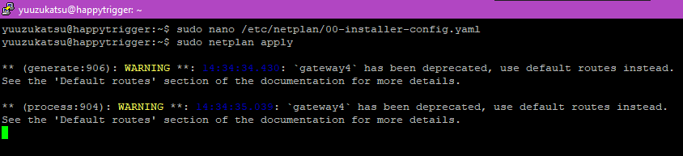
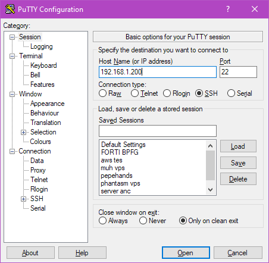
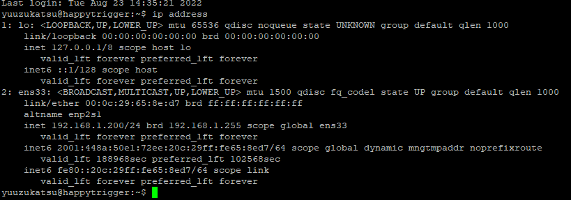
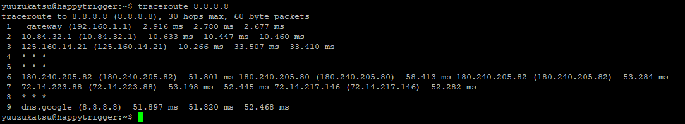
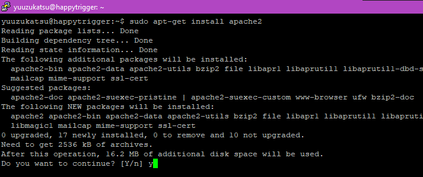
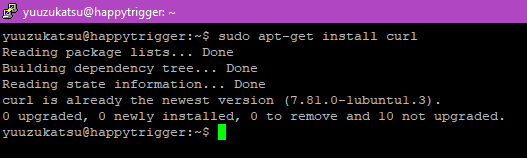
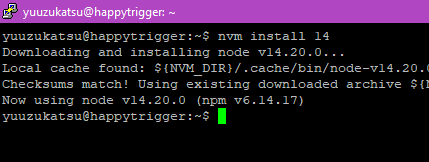
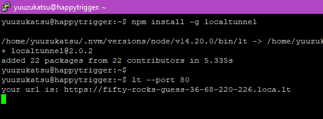
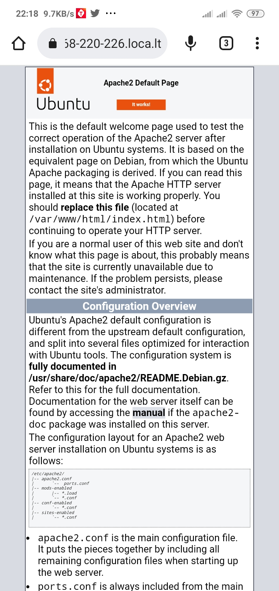

# Day 2

# Definisi Computer Network

Menurut saya, computer network (jaringan komputer) adalah kumpulan dua
atau lebih komputer yang saling terhubung melalui suatu media.

# Contoh perintah linux yang digunakan untuk management server linux

## Sudo

Sudo atau super user do, berguna untuk melakukan suatu command sebagai
user root tanpa harus login ke user root

## Ls

Ls digunakan untuk menampilkan list atau daftar file

## Mv

mv digunakan untuk memindahkan atau rename suatu file

## Cp

Cp digunakan untuk meng-copy file

## Usermod

Usermod digunakan untuk merubah informasi dari suatu user seperti group,
nama, lokasi home directory, dll

## Chmod

Chmod digunakan untuk merubah permission atau ijin akses suatu file
antara lain read, write, dan execute

## Chown

Chown digunakan untuk merubah kepemilikan suatu file

# Merubah IP server Ubuntu dan Tes koneksi ip baru dengan SSH

## Step 1

Buka sudo nano /etc/netplan/00-installer-config.yaml dengan text editor

`sudo nano /etc/netplan/00-installer-config.yaml`

{width="6.268055555555556in"
height="0.5895833333333333in"}

## Step 2

Ubah parameter ip,gateway, dan nameserver(dns) tersebut sesuai
kebutuhan. Save jika sudah (ctrl + o), atau exit dan save(ctrl + x, lalu
yes)

{width="4.896516841644795in"
height="2.7295472440944883in"}

## Step 3

Lalu jalankan command berikut untuk meng-apply parameter yang kita
masukkan sebelumnya

{width="6.268055555555556in"
height="1.4333333333333333in"}

## Step 4

Connect ke ip baru yang dimasukkan sebelumnya

{width="4.708333333333333in"
height="4.604166666666667in"}

{width="6.188363954505687in"
height="2.792055993000875in"}

## Step 5

Untuk mengecek ip saat ini, bisa menggunakan command berikut

`ip address`

{width="6.268055555555556in"
height="2.196527777777778in"}

## Step 6

Cek koneksi dengan ping atau traceroute

{width="6.268055555555556in"
height="3.4819444444444443in"}{width="6.268055555555556in"
height="1.1388888888888888in"}

# Instalasi Apache2 dan LocalTunnel

## Step 1

Lakukan instalasi apache2 dengan command berikut

`sudo apt-get install apache2`

{width="6.268055555555556in"
height="2.6284722222222223in"}

## Step 2

Pastikan service apache sudah running dengan command berikut

`service apache status`

Atau bisa gunakan command berikut

`systemctl status apache2`

{width="6.268055555555556in"
height="5.639583333333333in"}

Jika status menunjukkan active(running), maka service apache sudah
berhasil berjalan

## Step 3

Tes service apache dengan membuka ip server lewat browser

{width="6.268055555555556in"
height="3.386111111111111in"}

## Step 4

Untuk instalasi localtunnel, pastikan curl sudah terinstall dengan
command berikut

`curl`

{width="5.84456583552056in"
height="0.9897211286089239in"}

Jika muncul command not found, lakukan instalasi dengan command berikut
(foto dibawah jika curl sudah diinstal)

`sudo apt-get install curl`

{width="5.490349956255468in"
height="1.6460629921259842in"}

## Step 5

Localtunnel memerlukan node.js untuk menjalankan kodenya. Maka dari itu
kita akan menginstall nvm terlebih dahulu. Jalankan command berikut
untuk menginstall nvm

{width="6.268055555555556in"
height="1.85in"}

## Step 6

Lakukan instalasi node versi 14 dengan command berikut

` nvm install 14`

{width="4.469373359580053in"
height="1.6877351268591425in"}

## Step 7

Cek versi npm dan node yang terinstall dengan command berikut

`npm -v`

`node -v`

{width="3.448397856517935in"
height="1.5522998687664042in"}

## Step 8

Lakukan instalasi local tunnel melalui npm dengan command berikut

`npm install -g localtunnel`

{width="6.268055555555556in"
height="0.8305555555555556in"}

## Step 9

Buat tunnel ke port 80 http apache dengan command berikut

`lt \--port 80`

{width="5.573694225721785in"
height="2.0523698600174978in"}

Step 10

Buka url yang diberikan di browser

{width="6.268055555555556in"
height="3.386111111111111in"}

{width="4.591666666666667in"
height="9.693055555555556in"}
