# Day 3

# Definisi Aplikasi

Aplikai merupakah perangkat lunak yang melakukan fungsi tertentu dan
dioperasikan oleh pengguna/end-user

# Membuat Aplikasi sederhana menggunakan Node.js

## Step 1

Pastikan environment sudah terinstall dengan command berikut

`Node -v`

`Npm -v`

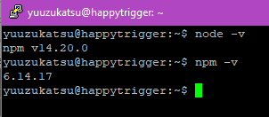

Jika belum, jalankan command berikut

`curl -o- https://raw.githubusercontent.com/nvm-sh/nvm/v0.38.0/install.sh | bash`

`exec bash`

`nvm install 14`

## Step 2

Ketikkan command berikut untuk menginisialisasi project node.js

`npm init -y`


Command ini akan meng-create file `package.json` yang berisi dependency,
nama aplikasi, dan lain lain

## Step 3

Kita akan membuat aplikasi backend simpel. Install express.js dengan
command berikut

`npm install express --save`


## Step 4

Buat file `index.js`, lalu isikan script berikut

```
const express = require("express");
const app = express();
const port = 3000;

app.get("/", (req, res) => {
  res.send("Hello World!");
});
```

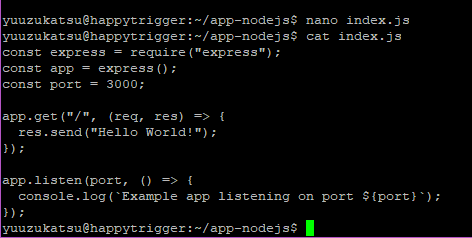

## Step 5

Jalankan aplikasi dengan command berikut

`node index.js`

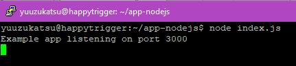

## Step 6

Buka ip server dengan port `3000` melalui browser


# Membuat Aplikasi sederhana menggunakan Python

## Step 1

Secara default,python sudah terinstall secara default di instalasi
ubuntu. Pastikan dengan menjalankan command berikut

`python3 -v`


Jalankan command berikut jika belum terinstall

`sudo apt-get install python3`

## Step 2

Install package manager python yang bernama pip dengan command berikut

`sudo apt install python3-pip`


## Step 3

Kita akan membuat aplikasi web dengan framework Flask. Install Flask
melalui pip

`pip install flask`

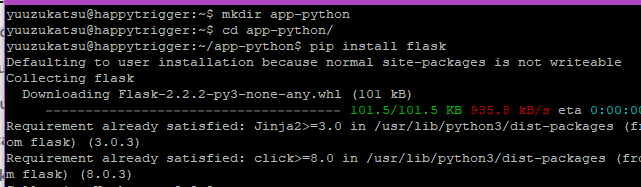

## Step 4

Buat file `index.py`, lalu isikan script berikut

```
from flask import Flask
app = Flask(__name__)
@app.route("/")
def helloworld():
    return "Hello World"
if __name__ == "__main__":
    app.run()
```


Pada bagian `app.run()`, rubah menjadi seperti ini agar bisa diakses dari
ip lain atau pc lain
```
app.run(host="0.0.0.0")
```
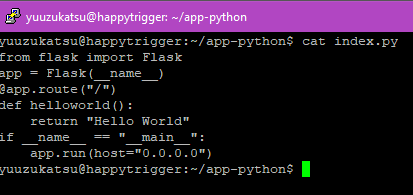

## Step 5

Jalankan aplikasi dengan command berikut

`python3 index.py`


## Step 6

Buka ip server dengan port `5000` melalui browser

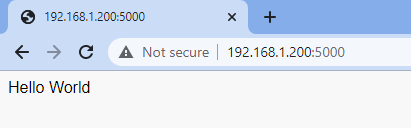

# Membuat Aplikasi sederhana menggunakan Go

## Step 1

Download dan Install engine Go dengan command berikut

`wget https://golang.org/dl/go1.16.5.linux-amd64.tar.gz && sudo su`

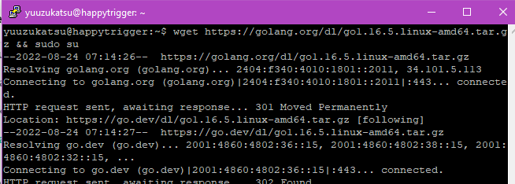

`rm -rf /usr/local/go && tar -C /usr/local -xzf go1.16.5.linux-amd64.tar.gz && exit`


## Step 2

Selanjutnya masukkan line berikut di akhir file `~/.bashrc`

`export PATH=$PATH:/usr/local/go/bin`

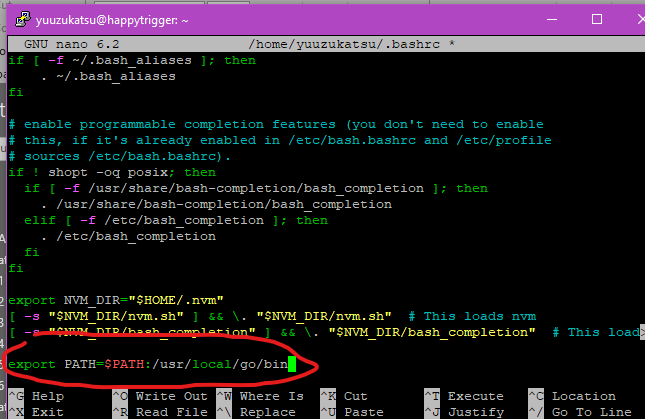

## Step 3

Cek instalasi engine Go dengan command berikut

`Exec bash`

`go version`

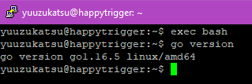

## Step 4

Buat file `index.go`, lalu isikan script berikut

```
package main

import "fmt"

func main() {
    fmt.Println("Hello World!")
}
```


## Step 5

Jalankan aplikasi dengan command berikut

`go run index.go`

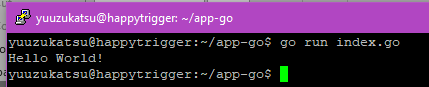

## Step 6

Jalankan command berikut untuk build aplikasi

`go build index.go`


## Step 7

Setelah selesai build, jalan berikut untuk menjalankan aplikasi

`./index`


# Menggunakan PM2+LocalTunnel untuk menjalankan Aplikasi

## Step 1

Download dan Install pm2 dengan command berikut

`npm install pm2@latest -g`

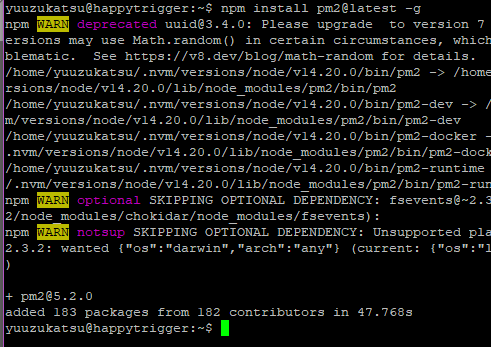

## Step 2

Jalankan command berikut untuk memastikan `pm2` sudah terinstall

`pm2`


## Step 3

Jalankan aplikasi node yang sudah dibuat sebelumnya dengan command
berikut

`pm2 start app-nodejs/index.js`


## Step 4

Jalankan aplikasi python yang sudah dibuat sebelumnya dengan command
berikut

`pm2 start app-python/index.py --interpreter python3`

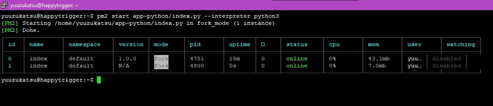

## Step 5

Untuk melihat process pm2 yang sudah perjalan, gunakan command berikut

`pm2 list`

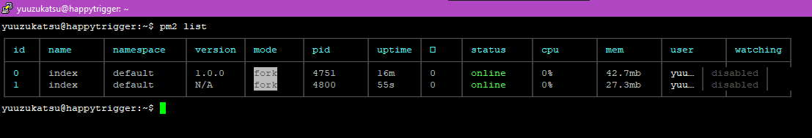

## Step 6

Cek melalui browser untuk mengecek apakah aplikasi sudah berjalan

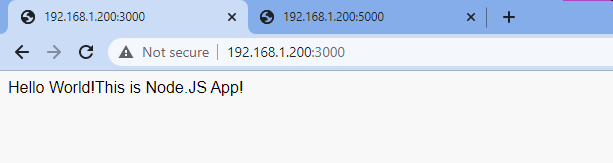


## Step 7

Jalankan command berikut untuk melakukan local tunnel ke port `3000`
aplikasi nodejs dan port `5000` aplikasi python yang sudah di jalankan
dengan pm2 sebelumnya (dijalankan bergantian)

`lt -p 3000`

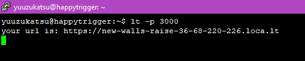


`lt -p 5000`

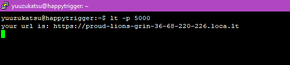

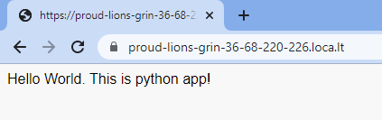