# Day 4

# Definisi Git

Menurut saya, git merupakan aplikasi yang digunakan untuk version
control, project/code colaboration, dan management.

# Contoh Perintah Git

## git clone

`Git clone` digunakan untuk mengcopy keseluruhan reposity ke repository
local baru yang akan dibuat

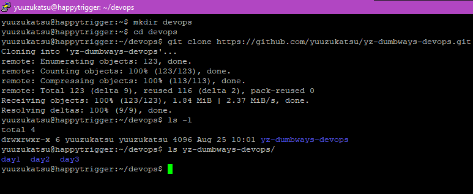 

## git log

menampilkan log/history commit dari repo

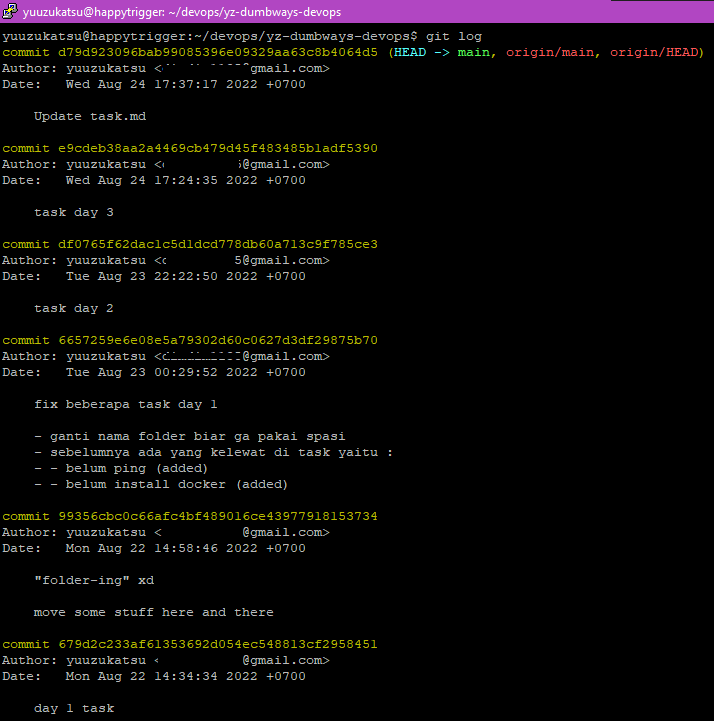 

## Git rm

`Git rm` digunakan untuk mengapus file dari repository lokal

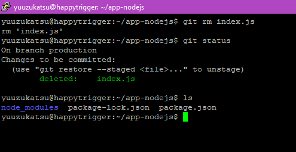 

## Git restore

`Git restore` digunakan untuk mengembalikan file yang sudah dihapus dengan
command `git rm`

 

# Menyiapkan environtment Git di Ubuntu

## Konfigurasi user, email, dan SSH Key

### Step 1

Pastikan git sudah terinstall dengan command:

`Git --version`

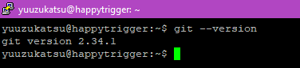

### Step 2

Isikan username dan email github dengan command berikut

### Step 3

Buat private key dan public key dengan command berikut:

`Ssh-keygen`

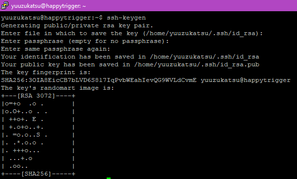 

### Step 4

Buka file `~/.ssh/id_rsa.pub` yang digenerate dari command `ssh-keygen`
sebelumnya. Copy isinya lalu simpan untuk sementara

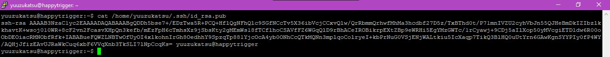 

### Step 5

Buka `github.com`, klik profil pada bagian kanan atas, lalu masuk ke menu
settings

### Step 6

Pilih bagian SSH and GPG keys, lalu klik New SSH Key

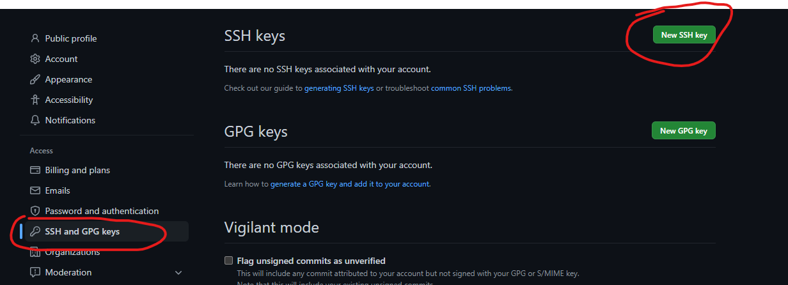 

### Step 7

Masukkan public key yang dicopy sebelumya ke kotak Key. Jika sudah klik
Add SSH Key

 

### Step 8

Cek koneksi ke Github dengan command berikut

`ssh -T git@github.com`

 

## Membuat dan Mengisi Repository+Branch dengan Aplikasi

### Step 1

Masuk ke folder yang akan di upload ke github

 

### Step 2

Ketikkan command berikut. Command ini akan membuat folder `.git` di folder
aplikasi

`git init`

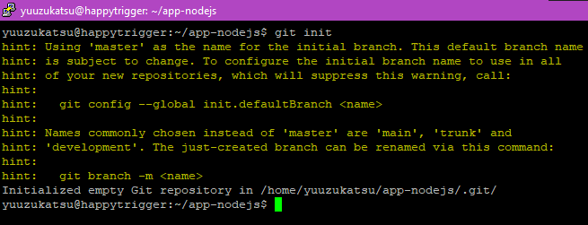

### Step 3

Sebelum upload, kita harus memilih file yang ingin kita upload. Kita
akan membuat file `.gitignore`. File ini berisi file atau direktori yang
tidak akan di upload. Contoh, kita tidak akan mengupload direktori
`node_modules`

`Touch .gitignore`

`Echo "node_modules" > .gitignore`

 

### Step 4

Setelah itu, kita akan memilih file yang akan kita upload. Ini akan
membuat file memasuki fase staged dimana file siap untuk di
commit(ditulis ke repository)

`git add <file>`

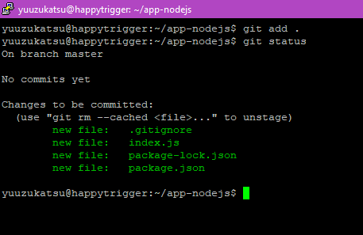 

Jalankan git status untuk mengecek apakah file sudah ditambahkan
(ditandai dengan warna hijau)

### Step 5 

Buka github, lalu buat repository baru dengan memilih New repository
(Jika sudah membuat repo, skip ke step 7)

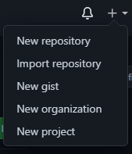 

### Step 6

Isikan nama repo lalu klik create repository dibawah

 

### Step 7

Pilih SSH, lalu copy baris berikut

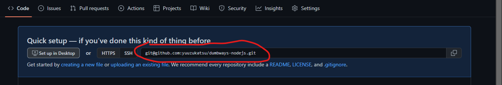

Jika sudah membuat repository, klik code lalu pilih berikut

### Step 8

Buka terminal kembali, lalu isikan kode berikut

`git remote add <remote-name> <url>`

 

Cek dengan command `git remote -v` untuk melihat daftar remote yang sudah
terdaftar didalam repository lokal

### Step 9

Lakukan commit untuk menulis file kedalam repository lokal dengan
command berikut

`git commit -m "my first commit"`

 

### Step 10

Lakukan push untuk mengirim file yang berada di repository lokal ke
repository github.

`git push <remote-name> <branch-name>`

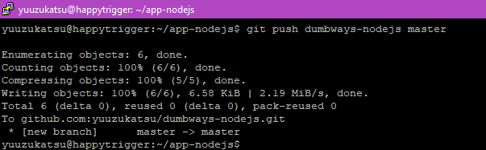

Isikan `<remote-name> ` dengan nama remote yang dibuat sebelumnya.
`<branch-name> ` secara default jika tidak disebutkan saat `git init`, akan
menggunakan `master`

### Step 11

Jika kita cek di github, maka file yang kita buat sudah muncul

### Step 12

Buat branch baru dengan command berikut

`Git branch <branch-name>`

 

Lihat daftar branch yang sudah ada dengan command `git branch -a`

### Step 13

Saat ini kita masih di branch `master`. Untuk berpindah ke branch lain,
gunakan command berikut

`git checkout <branch-name>`

 

### Step 14

Lalu kita akan push branch tersebut ke github. Gunakan command berikut

`Git push <remote-name> <branch-name>`

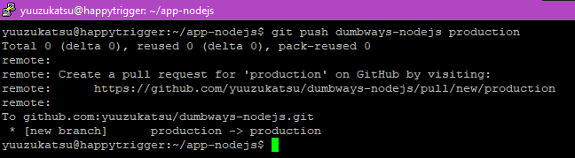 

### Step 15

Kita cek di github. Akan muncul branch baru beserta isinya

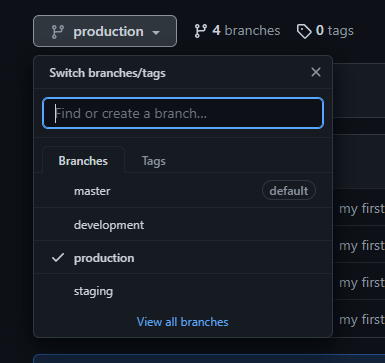 

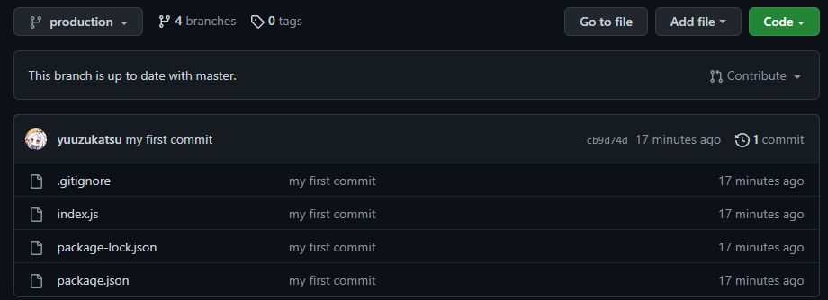 

