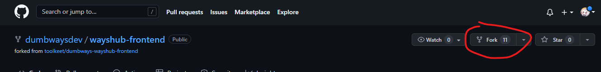
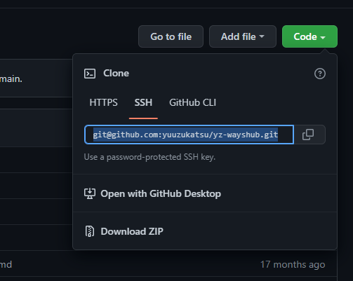
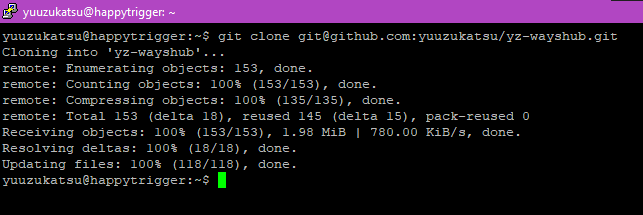
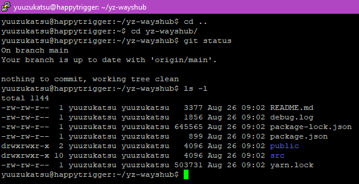
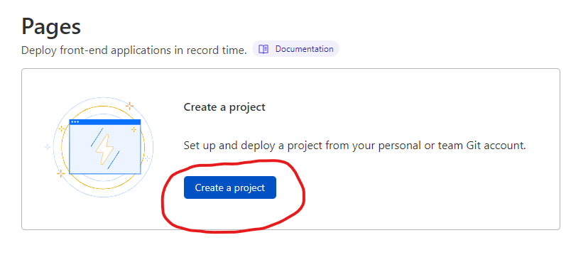
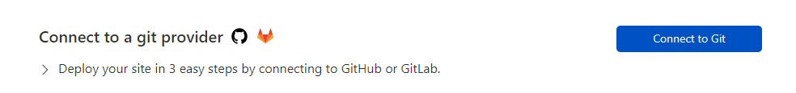
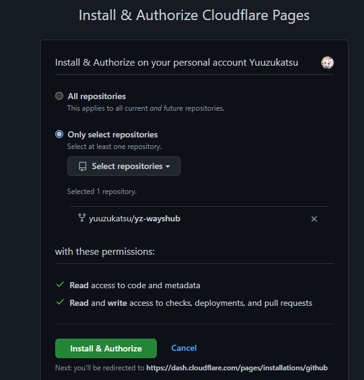
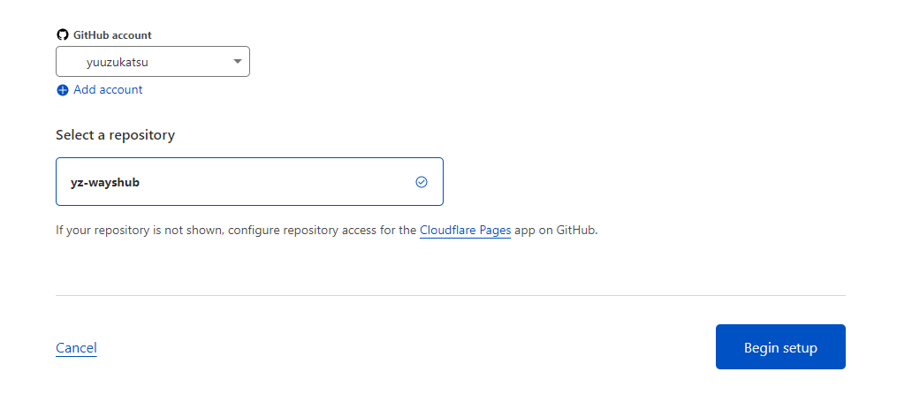
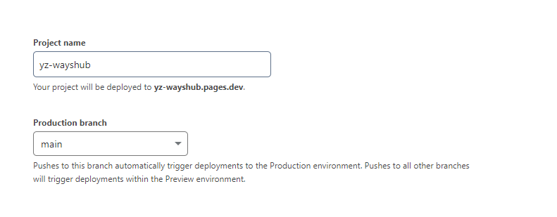
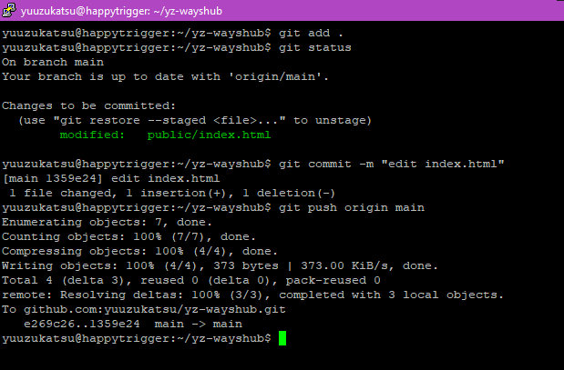

# Day 5

# CI/CD with Cloudflare Pages

## Definisi Cloudflare Pages

Menurut saya, Cloudflare Pages merupakan salah satu feature dari
Cloudfare yang digunakan untuk CD(Continous Delivery)

## Deploy Aplikasi ke Cloudflare Pages dengan Github

### Step 1

Fork repository `https://github.com/dumbwaysdev/wayshub-frontend`




### Step 2

Clone repo tersebut ke server

`git clone <clone-url>`





### Step 3

Cek directory yang sudah dibuat (sesuai nama repo yang dibuat)

 

### Step 4

Buka Cloudflare Pages dan pilih `Create Project`

 

 

### Step 5

Pilih `Connect to Git`

 

### Step 6

Pilih `Connect GitHub`

 

### Step 7

Pilih `Only select repositories` dan pilih repo yang di fork sebelumnya

 

### Step 8

Klik repo yang diinginkan di `Select a repository` dan lalu klik `Begin Setup`

 

### Step 9

Isikan `Project name` dan pilih `Branch` yang akan di deploy

 

### Step 10

Jika aplikasi memiliki command build spesik, isikan berikut. Jika sudah
klik `Save and Deploy`

 

### Step 11

Setelah build selesai, akan muncul link yang bisa dibuka

 

 

### Step 12

Selanjutnya kita akan coba merubah file `index.html`. Lalu cari tag html
`<title>` dan rubah isinya

`nano public/index.html`

 

### Step 13

Lakukan `add`, `commit`, lalu lakukan `push`

```git add .```

```git commit -m "edit index.html"```

```git push origin main```

 

### Step 14

Jika cek di Cloudflare Pages, akan muncul ada commit baru dan sedang
di-build

 

### Step 15

Buka lagi web sebelumnya, title sudah berubah

 
