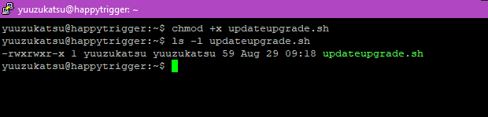
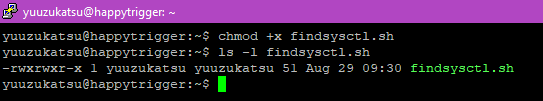
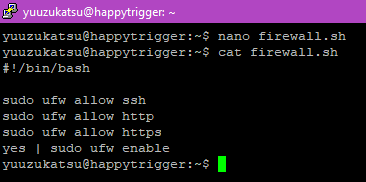
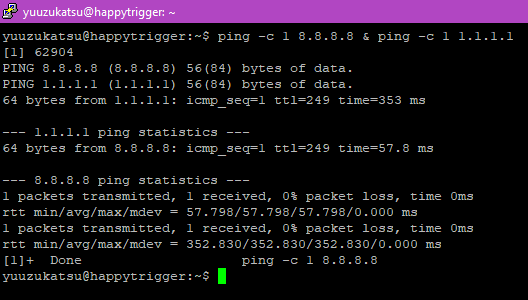

# Day 6

# Manage Server With Terminal

## Definisi Terminal

Terminal merupakan tampilan berbasis teks yang digunakan untuk
mengoperasikan sistem operasi

## Keuntungan menggunakan Terminal

-   Lebih ringan dalam penggunaan resource perangkat

-   Lebih mudah dalam melakukan automasi

-   Pengoperasian bisa lebih cepat

## Membuat script bash untuk update dan upgrade

### Step 1

Buat file kosong baru dan isikan berikut
```
#!/bin/bash

sudo apt-get -y update

sudo apt-get -y upgrade
```
 

### Step 2

Tambahkan permission execute di file dengan command `chmod`

```chmod +x <file-name>```

 

### Step 3

Jalankan script dengan command berikut

```./<filename>```

atau

```bash <filename>```

 

## Membuat script bash untuk mencari file `sysctl.conf`

### Step 1

Buat file kosong dan isikan berikut
```
#!/bin/bash

sudo find / -name sysctl.conf -type f
```
 

### Step 2

Tambahkan permission execute di file dengan command `chmod`

```chmod +x <file-name>```

 

### Step 3

Jalankan script dengan command berikut

```./<filename>```

atau

```bash <filename>```

 

## Membuat script bash untuk membuka firewall port 22, 80, dan 443

### Step 1

Buat file kosong dan isikan berikut
```
#!/bin/bash

sudo ufw allow ssh

sudo ufw allow http

sudo ufw allow https

yes | sudo ufw enable
```
 

### Step 2

Tambahkan permission execute di file dengan command `chmod`

```chmod +x <file-name>```

 

### Step 3

Jalankan script dengan command berikut

```./<filename>```

atau

```bash <filename>```

 

