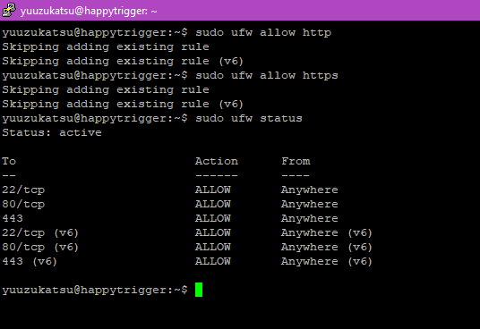
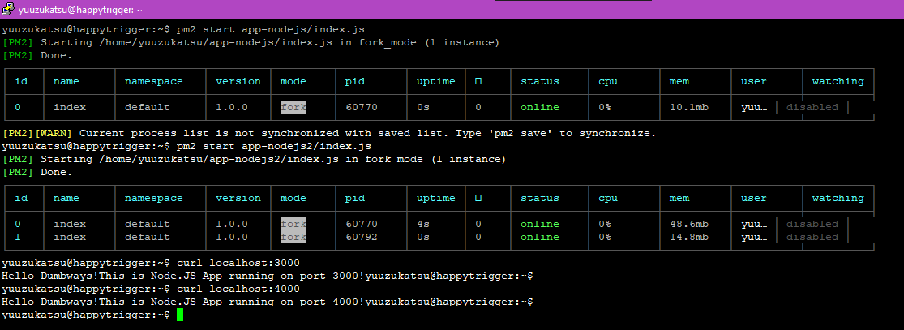
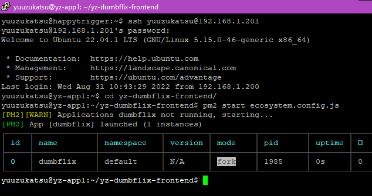
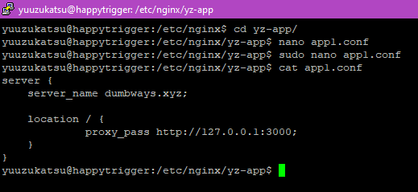
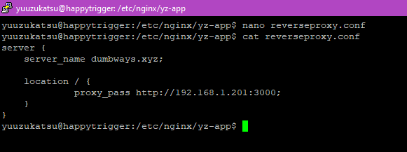
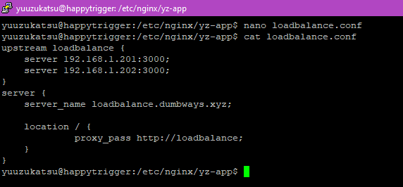
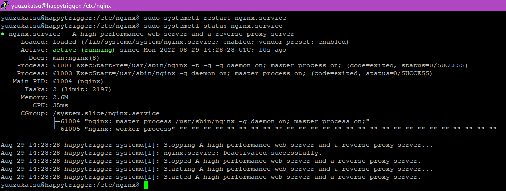
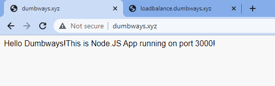
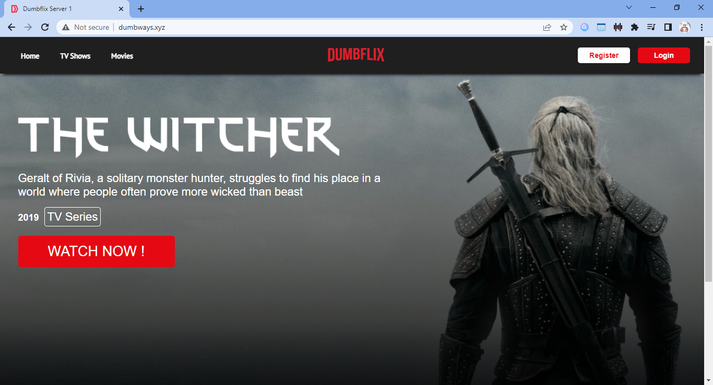

# Day 7

# Web Server & Load Balancing

## Definisi Web Server

Web Server merupakan service yang berfungsi untuk melayani dan memproses
request HTTP

## Instalasi Nginx

### Step 1

Lakukan instalasi nginx dengan command

```sudo apt-get install nginx```

 

### Step 2

Cek status nginx, pastikan sudah berjalan dengan command

```systemctl status nginx.service```

atau

```service nginx status```

 

### Step 3

Jika menggunakan `ufw`, pastikan untuk allow port dengan command berikut

```sudo ufw allow http```

sudo ufw allow https

 

## Konfigurasi Reverse Proxy dan Load Balancer di 2 aplikasi NodeJS yang berbeda

Aplikasi nodejs sudah berjalan, dengan aplikasi 1 berjalan di port `3000`
dan aplikasi 2 berjalan di port `4000`

 

### Step 1

Buka directory `/etc/nginx` lalu buat 2 file berakhiran `.conf`
```
cd /etc/nginx

sudo mkdir yz-app

sudo touch yz-app/app1.conf yz-app/app2.conf
```
 

### Step 2

Edit file `app1.conf` dan isikan berikut
```
server {

    server_name dumbways.xyz;

    location / {

        proxy_pass http://127.0.0.1:3000;

    }

}
```
 

### Step 3

Edit file `app2.conf` dan isikan berikut
```
upstream app2 {

    server 127.0.0.1:4000;

}

server {

    server_name loadbalance.dumbways.xyz;

    location / {

        proxy_pass http://app2;

    }

}
```
 

Step 4

Buka file `/etc/nginx/nginx.conf` lalu tambahkan line berikut

```include /etc/nginx/yz-app/*.conf;```

 

### Step 4

Cek konfigurasi nginx sudah benar dengan command berikut :

```sudo nginx -t```

 

### Step 5

Lakukan restart service `nginx`

```sudo systemctl restart nginx```

atau

```sudo service nginx restart```

 

Step 6

Dari sisi client, tambahkan line berikut di file `/etc/hosts`. Jika
menggunakan windows tambahkan di file
`C:\Windows\System32\drivers\etc\hosts`
```
192.168.1.200 loadbalance.dumbways.xyz

192.168.1.200 dumbways.xyz
```
 

### Step 6

Buka domain dari browser

 


